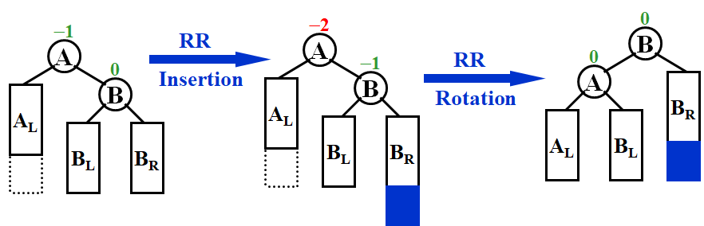
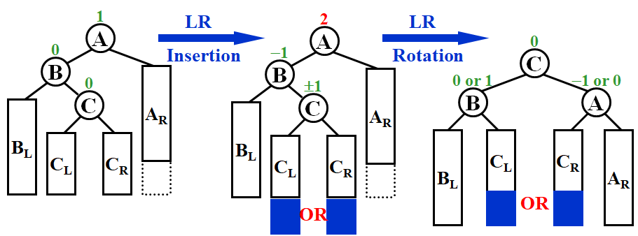
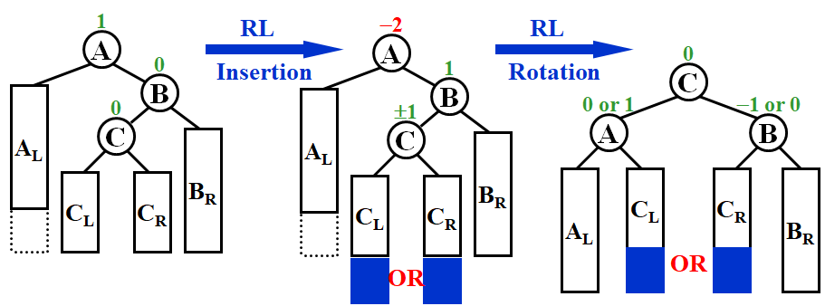
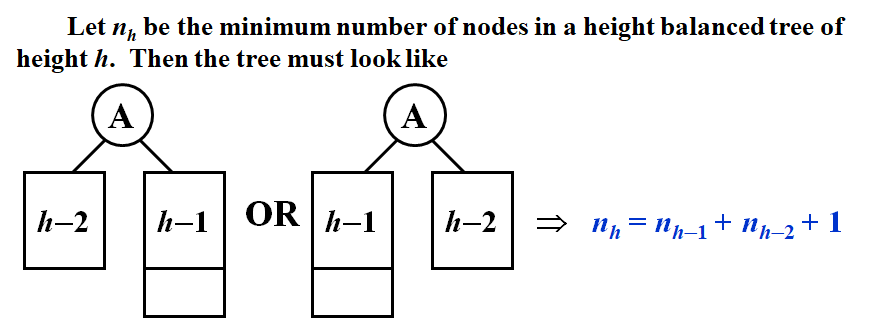
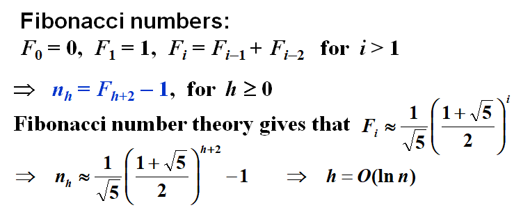

# WEEK1

## 1 AVL Trees, Splay Trees and Amortized Analysis

### 1.1 AVL Trees

- **Target**: Speed up searching (with insertion and deletion)
- **Tool**: Binary search trees
- **Problem**: Although $T_p = O( height )$, but the height can be as bad as $O( N )$

#### [Definition] An empty binary tree is height balanced. If $T$ is a nonempty binary tree with $T_L$ and $T_R$ as its left and right subtrees, then $T$ is *height balanced* if and only if

- $T_L$ and $T_R$ are height balanced, and
-  $| h_L - h_R | \leq 1$ where $h_L$ and $h_R$ are the heights of $T_L$ and $T_R$ , respectively.

> Note: The height of an empty tree is defined to be -1, and the height of a single node is defined to be 0.

#### [Definition] The balance factor $BF( node ) = h_L - h_R$. In an AVL tree, $BF( node ) = -1, 0, or 1$.

#### Single Rotation

##### RR Rotation

##### LL Rotation

#### Double Rotation

##### LR Rotation

##### RL Rotation

#### Conclusion

- Single Rotation中RR对应一次逆时针，LL对应一次顺时针
- Double Rotation中从后往前读，R对应一次逆时针，L对应一次顺时针
  - LR先逆时针再顺时针
  - RL先顺时针再逆时针

> Note: Several bf’s might be changed even if we don’t need to reconstruct the tree.

#### The height of AVL Tree

### 1.2 Splay Trees

- **Target**: Any $M$ consecutive tree operations starting from an empty tree take at most $O(M log N)$ time.