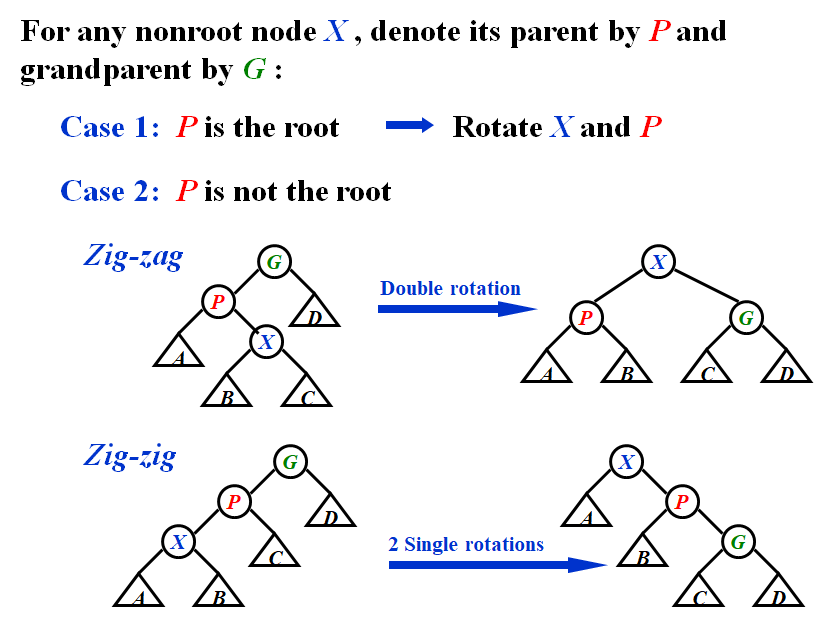

# WEEK1

## 1 AVL Trees, Splay Trees and Amortized Analysis

### 1.1 AVL Trees

- **Target**: Speed up searching (with insertion and deletion)
- **Tool**: Binary search trees
- **Problem**: Although $T_p = O( \text{height} )$, but the height can be as bad as $O( N )$

#### [Definition] An empty binary tree is height balanced. If $T$ is a nonempty binary tree with $T_L$ and $T_R$ as its left and right subtrees, then $T$ is *height balanced* if and only if

- $T_L$ and $T_R$ are height balanced, and
-  $| h_L - h_R | \leq 1$ where $h_L$ and $h_R$ are the heights of $T_L$ and $T_R$ , respectively.

> Note: The height of an empty tree is defined to be -1, and the height of a single node is defined to be 0.

#### [Definition] The balance factor $BF( node ) = h_L - h_R$. In an AVL tree, $BF( node ) = -1, 0, or 1$.

#### Single Rotation

##### RR Rotation

##### LL Rotation

#### Double Rotation

##### LR Rotation

##### RL Rotation

#### Conclusion

- Single Rotation中RR对应一次逆时针，LL对应一次顺时针
- Double Rotation中从后往前读，R对应一次逆时针，L对应一次顺时针
  - LR先逆时针再顺时针
  - RL先顺时针再逆时针

> Note: Several bf’s might be changed even if we don’t need to reconstruct the tree.

The correct answer is A.

#### The height of AVL Tree

### 1.2 Splay Trees

- **Target**: Any $M$ consecutive tree operations starting from an empty tree take at most $O(M \log N)$ time.

> Note: AVL Tree is a kind of Splay Tree because every operation takes $O(\log N)$ time.

- Splay Tree only means that the **amortized** time is $O(\log N)$. A single operation might still take $O(N)$ time.
- The bound is weaker. But the effect is the same: There are **no bad** input sequences.
- Whenever a node is accessed, it must be moved to avoid the case of successive operations taking $O(N)$ time.
- **Idea**: After a node is accessed, it is pushed to the root by a series of AVL tree rotations.

#### A simple solution

- Only use single rotation

- The time complexity of the worst case might be $O(N^2)$, so it doesn’t work.

#### Splaying

> Note: The operation order of one Zig-zig is from up to down.

- Splaying not only moves the accessed node to the root, but also roughly halves the depth of most nodes on the path.

#### Deletions

- **Step1**: Find X and X will be at the root
- **Step2**: Remove X and there will be two subtrees $T_L$ and $T_R$
- **Step3**: $FindMax ( T_L ) $ and the largest element will be the root of TL , and has no right child
- **Step4**: Make $T_R$ the right child of the root of $T_L$

### 1.3 Amortized Analysis 摊还分析

- **Target**: Any $M$ consecutive operations take at most $O(M log N)$ time. — **Amortized** time bound
- worst-case bound $\geq$ **amortized bound** $\geq$ average-case bound
- Probability is not involved in amortized bound
- 摊还分析可以保证最坏情况下每个操作的平均性能

#### Aggregate analysis 聚合分析

- **Idea**: Show that for all $n$, a sequence of $n$ operations takes **worst-case** time $T(n)$ in total. In the worst case, the average cost, or **amortized cost**, per operation is therefore $T(n)/n$.

- We can pop each object from the stack **at most once** for each time we have pushed it onto the stack

#### Accounting method 核算法

- **Idea**: When an operation’s **amortized cost** $\hat c_i$ exceeds its **actual cost** $c_i$, we assign the difference to specific objects in the data structure as **credit**. Credit can help **pay** for later operations whose amortized cost is less than their actual cost.

- The difference between aggregate analysis and accounting method is that the later one assumes that the amortized costs of the operations may **differ** from each other
  
- For all sequences of $n$ operations, we have
  $$
  \sum^n_{i=1}\hat c_i\geq \sum^n_{i=1}c_i
  $$

  $$
  T_{amortized}=\frac{\sum^n_{i=1}\hat c_i}{n}
  $$

#### Potential method 势能法

- **Idea**: Take a closer look at the **credit** — $\hat c_i-c_i=\text{Credit}_i=\Phi(D_i)-\Phi(D_{i-1})$
- $D_i$ id defined to be the structure of the current situation
- Potential function maps the current structure of the problem into a number

$$
\hat c_i=c_i+\Phi(D_i)-\Phi(D_{i-1})\\
\sum^n_{i=1}\hat c_i=\sum^n_{i=1}(c_i+\Phi(D_i)-\Phi(D_{i-1}))=\sum^n_{i=1}c_i+\Phi(D_n)-\Phi(D_0)
$$

- A good potential function should always assume its minimum at the start of the sequence

##### Splay Trees势能分析

- 势能函数是树中所有节点的rank之和
  $$
  \Phi(T)=\sum^n_{i=1}R(i)=\sum^n_{i=1}\log S(i)
  $$
  其中$S(i)$指的是子树$i$中的节点数(包括节点$i$)，用$R(i)$表示节点$i$的rank，$R(i)=\log S(i)$

- 用$R_2$表示操作后的势能，$R_1$表示操作前势能

- zig
  - 实际成本是一次单旋，为1
  - 只有$X$和$P$的rank值有变化，故$\hat c_i = 1 + R_2(X) − R_1(X) + R_2(P) − R_1(P)$
  - 节点$P$ 由根节点变为非根节点，故$R_2(P)-R_1(P)\leq0$，因此$\hat c_i\leq 1+R_2(X)-R_1(X)\leq 1+3(R_2(X)-R_1(X))$
- zig-zag
  - 实际成本是两次旋转，为2
  - $\hat c_i = 2 + R_2(X) − R_1(X) + R_2(P) − R_1(P)+R_2(G) − R_1(G)$
  - 操作前$G$是根节点，操作后$X$是根节点，rank相同，故$\hat c_i = 2− R_1(X) + R_2(P) − R_1(P)+R_2(G)$
  - $R_1(P)\geq R_1(X)$
  - $S_2(P)+S_2(G)\leq S_2(X)$，根据定理可得$R_2(P)+R_2(G)\leq 2R_2(X)-2$
  - $\hat c_i\leq2(R_2(X)-R_1(X))$
- zig-zig
  - 实际成本是两次单旋，为2
  - $\hat c_i = 2 + R_2(X) − R_1(X) + R_2(P) − R_1(P)+R_2(G) − R_1(G)$
  - 操作前$G$是根节点，操作后$X$是根节点，rank相同，故$\hat c_i = 2− R_1(X) + R_2(P) − R_1(P)+R_2(G)$
  - $R_1(P)\geq R_1(X)$
  - $R_2(G)\leq R_2(P)\leq R_2(X)$
  - $\hat c_i\leq2(R_2(X)-R_1(X))+2\leq3(R_2(X)-R_1(X))$
- **[Theorem]** The amortized time to splay a tree with root $T$ at node $X$ is at most $3( R( T ) – R ( X ) ) + 1 = O(log N)$.