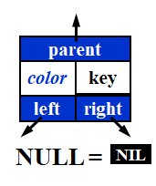
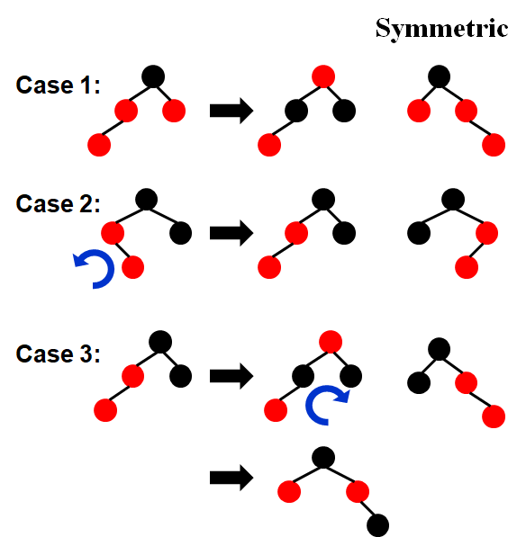
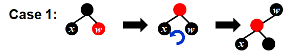
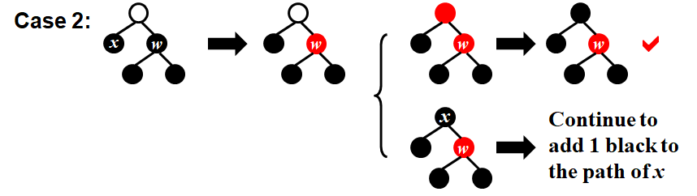
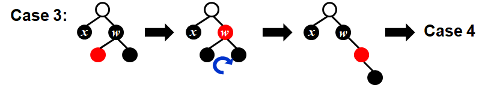
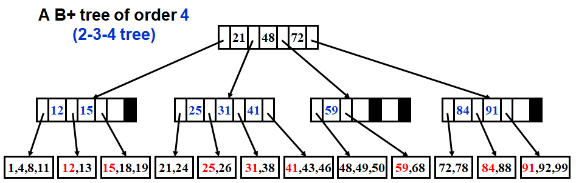

# WEEK 2

## 2 Red-Black Trees and B+ Trees

### 2.1 Red-Black Trees

- **Target**: Balanced binary search tree



#### [Definition] **A** *red-black tree* **is a binary search tree that satisfies the following** *red-black* properties:

- Every node is either red or black
- The root is black
- Every leaf (NIL) is black
- If a node is red, then both its children are black
- For each node, all simple paths from the node to descendant leaves contain the same number of black nodes

#### [Definition] The *black-height* of any node $x$, denoted by $bh(x)$, is the number of black nodes on any simple path from $x$ ($x$ not included) down to a leaf.  $bh(Tree) = bh(root)$.

#### [Lemma] **A red-black tree with** $N$ **internal nodes has height at most** $2\ln(N +1)$.

- For any node $x$, $sizeof(x) \geq 2^{bh(x)} – 1$.  Proved by induction.
- $bh(Tree) \geq h(Tree) / 2  $

#### Insert

- 插入的结点设为红色



- $T=O(h)=O(\ln N)$

#### Delete

- **Delete a leaf node**: Reset its parent link to NIL
- **Delete a degree 1 node**: Replace the node by its single child
- **Delete a degree 2 node**:
  - Replace the node by the **largest** one in its **left** subtree or the **smallest** one in its **right** subtree
  - Delete the replacing node from sub tree



                                                                                                                                                                                                                                                                                                                                                                                                                                                                                                                                        




### 2.2 B+ Trees

#### [Definition] A *B+ tree* of order $M$ is a tree with the following structural properties:

- The root is either a leaf or has **between $2$ and $M$ children**.
- All nonleaf nodes (except the root) have **between $\lceil M/2\rceil$ and $M$ children**.
- All leaves are at the **same depth**.

> Note: Assume each nonroot leaf also has **between $\lceil M/2\rceil$ and $M$ children**.



- All the actual data are stored at leaves
- Each interior node contains $M$ pointers to the children, and $M-1$ smallest key values in the subtrees except the first one.
- Deletion is similar to insertion except that the root is removed when it loses two children.

```pseudocode
Btree Insert ( ElementType X,  Btree T ) 
{ 
	Search from root to leaf for X and find the proper leaf node;
	Insert X;
	while ( this node has M+1 keys ) 
	{
    	split it into 2 nodes with \lceil(M+1)/2\rceil and \lfloor(M+1)/2\rfloor keys, respectively;
    	if (this node is the root)
        	create a new root with two children;
    	check its parent;
	}
} 
```

$$
Depth(M,N)=O(\lceil\log_{\lceil M/2\rceil}N\rceil)
$$

$$
T_{Find}(M,N)=O(\log N)
$$

> Note: The best choice of $M$ is **3** or **4**.