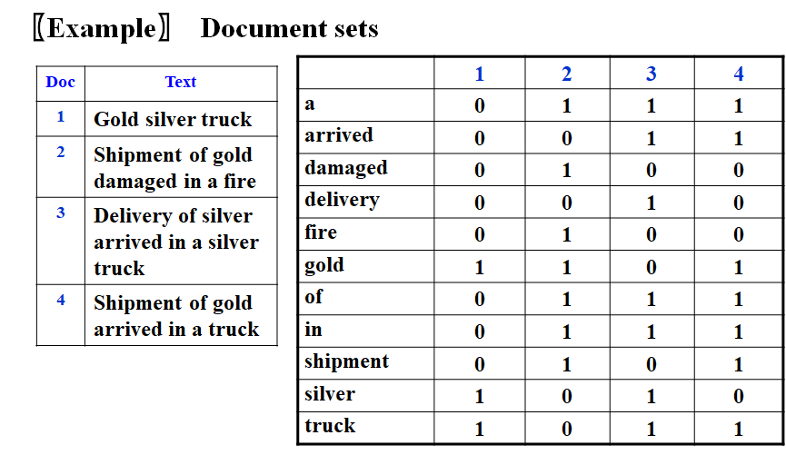
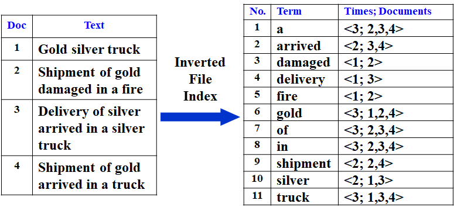
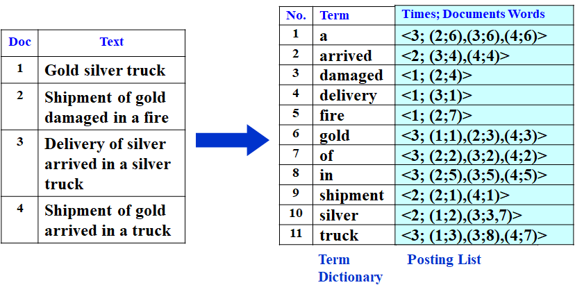
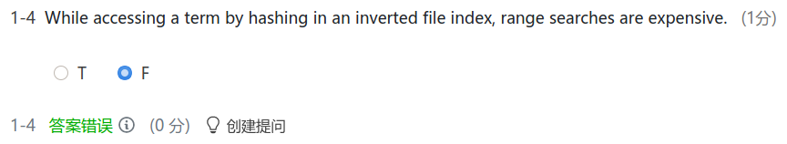
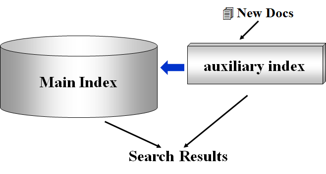
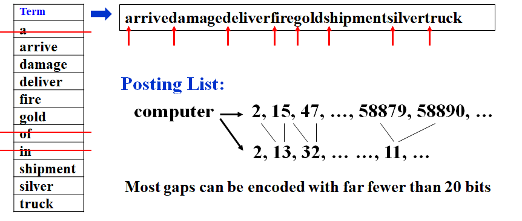
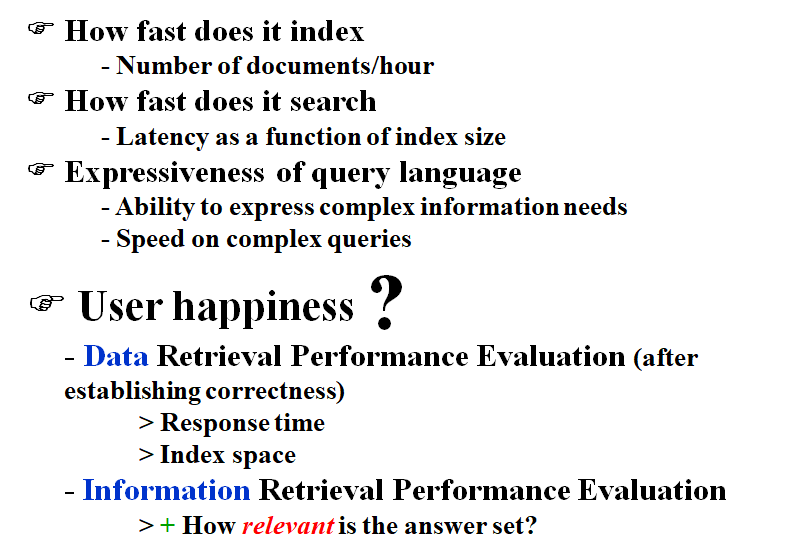
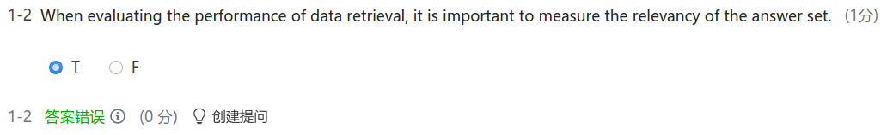
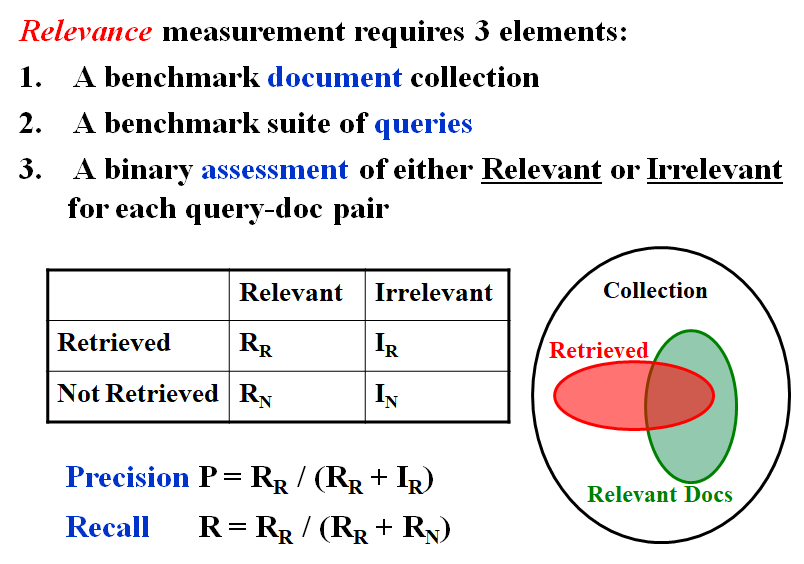
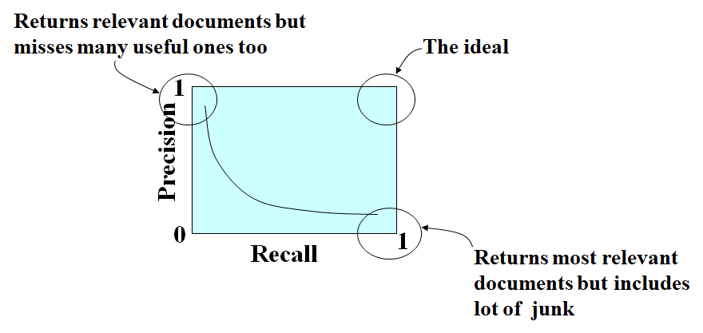

# WEEK 3

## 3 Inverted File Index

### 3.1 Solution1: Scan each page

### 3.2 Solution2: Term-Document Incidence Matrix



### 3.3 Solution3: Compact Version - Inverted File Index

#### [Definition] ***Index*** is a mechanism for locating a given term in a text.

#### [Definition] ***Inverted file*** contains a list of pointers (e.g. the number of a page) to all occurrences of that term in the text



> Note: Inverted because it lists for a term, all documents that contain the term.



- AND操作从最小频率的term开始求交，速度快

### 3.4 Index Generator

```pseudocode
while ( read a document D ) /*1*/
{
    while ( read a term T in D ) /*2*/
    {
        if ( Find( Dictionary, T ) == false ) /*3*/
            Insert( Dictionary, T );
        Get T’s posting list;
        Insert a node to T’s posting list;
    }
}
Write the inverted index to disk; /*4*/
```

1. Token Analyzer plus Stop Filter
2. Vocabulary Scanner
3. Vocabulary Insertor
4. Memory Management

### 3.5 Token Analyzer plus Stop Filter

#### Word Stemming

- Process a word so that only its stem or root form is left. 


#### Stop Words

- Some words are so common that almost every document contains them, such as “a” “the” “it”.  It is useless to index them.  They are called **stop words**.  We can eliminate them from the original documents.

### 3.6 Vocabulary Scanner and Insertor

- Solution 1: Search trees(B- trees, B+ trees, Tries, …)
- Solution 2: Hashing is faster for one word, but scanning in sequential order is not possible



### 3.7 Memory Management

```pseudocode
BlockCnt = 0; 
while ( read a document D ) 
{
	while ( read a term T in D ) 
	{
    	if ( out of memory ) 
    	{
     		Write BlockIndex[BlockCnt] to disk;
      		BlockCnt++;
      		FreeMemory;
    	}
    	if ( Find( Dictionary, T ) == false )
      		Insert( Dictionary, T );
    	Get T’s posting list;
    	Insert a node to T’s posting list;
    }
}
for ( i = 0; i < BlockCnt; i++ )
	Merge( InvertedIndex, BlockIndex[i] );
```

- 在写磁盘之前先排序，归并效率高

### 3.8 Distributed indexing

- Each node contains index of a subset of collection

- Solution 1: Term-partitioned index
- Solution 2: Document-partitioned index

### 3.9 Dynamic indexing

- Docs come in over time

  - postings updates for terms already in dictionary
  - new terms added to dictionary

- Docs get deleted

  

### 3.10 Compression



### 3.11 Thresholding

- Document: only retrieve the top $x$ documents where the documents are ranked by weight
  - Not feasible for Boolean queries
  - Can miss some relevant documents due to truncation
  
- Query: Sort the query terms by their frequency in ascending order; search according to only some percentage of the original query terms

  

### 3.12 Measures for a search engine









