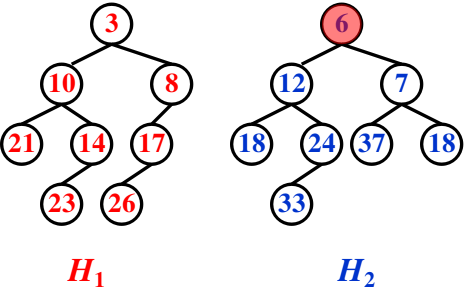
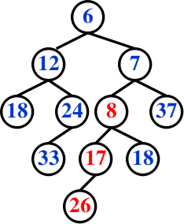
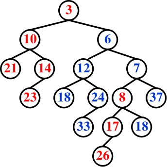
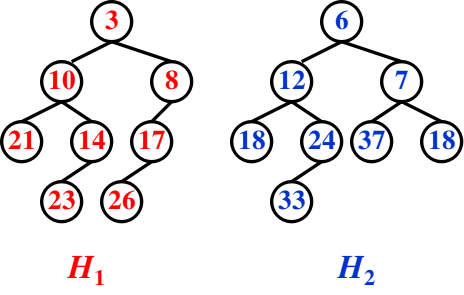
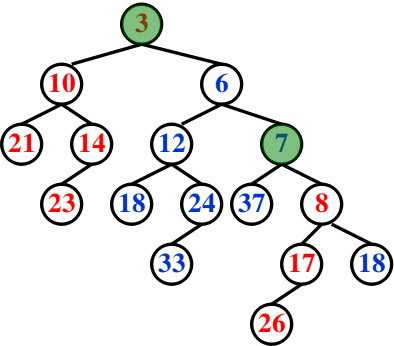
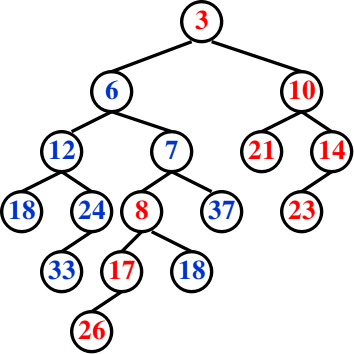
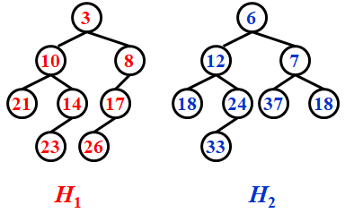
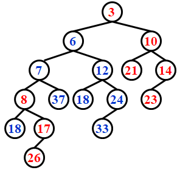

# WEEK 4

## 4 Leftist Heaps and Skew Heaps

### 4.1 Leftist Heaps

- **Target**: Speed up merging in $O(N)$

- Heap: Structure Property + Order Property
- Leftist Heap
  - Order Property – the same
  - Structure Property – binary tree, but **unbalanced**

#### [Definition] The *null path length*, Npl(X), of any node X is the length of the shortest path from X to a node without two children.  Define Npl(NULL) = –1.

> Note: Npl(X) = min{ Npl(C) + 1 for all C as children of X }

#### [Definition] The *leftist heap property* is that for every node X in the heap, the null path length of the left child is *at least as large as* that of the right child.

- The tree is biased to get deep toward the left.

#### [Theorem] A leftist tree with $r$ nodes on the right path must have at least $2^r – 1$ nodes.

> Note: The leftist tree of $N$ nodes has a right path containing at most $\lfloor\log_2(N+1)\rfloor$ nodes.

- We can perform all the work on the right path, which is guaranteed to be short
- Trouble makers: Insert and Merge may destroy leftist heap property

> Note: Insertion is merely a special case of merging.

#### Declaration

```c
struct TreeNode 
{ 
	ElementType	Element;
	PriorityQueue Left;
	PriorityQueue ight;
	int Npl;
};
```

#### Merge (recursive version)



- Step 1: Merge( H1->Right, H2 )

  

- Step 2: Attach( H2, H1->Right )

  

- Step 3: Swap(H1->Right, H1->Left ) if necessary

```c
PriorityQueue Merge( PriorityQueue H1, PriorityQueue H2 )
{ 
	if ( H1 == NULL ) return H2;	
	if ( H2 == NULL ) return H1;	
	if ( H1->Element < H2->Element ) return Merge1( H1, H2 );
	else return Merge1( H2, H1 );
}
```

```c
static PriorityQueue Merge1( PriorityQueue H1, PriorityQueue H2 )
{ 
	if ( H1->Left == NULL ) /* single node */
		H1->Left = H2; /* H1->Right is already NULL and H1->Npl is already 0 */
	else 
    {
		H1->Right = Merge( H1->Right, H2 ); /* Step 1 & 2 */
		if ( H1->Left->Npl < H1->Right->Npl )
			SwapChildren(H1);	/* Step 3 */
		H1->Npl = H1->Right->Npl + 1; /*If Npl is not updated, */
	} /* end else */
	return H1;
}
```

$$
T_p=O(\log N)
$$

#### Merge(iterative version)



- Step 1: Sort the right paths without changing their left children

  

- Step 2: Swap children if necessary

  

#### Insert

```c
PriorityQueue Insert1(ElementType X, PriorityQueue H)
{
	PriorityQueue SingleNode;
	SingleNode = malloc(sizeof(struct TreeNode));
	if( SingleNode == NULL)
		Fatal Error("Out of space!!!") ;
	else
	{ 
        SingleNode->Element = X;
        SingleNode->Npl = 0;
		SingleNode->Left = SingleNode->Right = NULL;
		H = Merge(SingleNode, H);
	}
	return H;
}
```

#### DeleteMin

- Step 1: Delete the root
- Step 2: Merge the two subtrees

```c
PriorityQueue DeleteMin1(PriorityQueue H)
{
	PriorityQueue LeftHeap, RightHeap;
	if(Is Empty(H))
	{
		Error("Priority queue is empty" ");
		return H;
	}
	LeftHeap = H->Left;
	RightHeap = H->Right;
	free (H);
	return Merge(LeftHeap, RightHeap);
}
```

$$
T_p=O(\log N)
$$

### 4.2 Skew Heaps

- a simple version of the leftist heaps
- 斜堆的右路径在任何时刻都可以任意长，所有操作的最坏情形运行时间均为$O(N)$
- **Target**: Any $M$ consecutive operations take at most $O(M \log N)$ time.

#### Merge

- **Always** swap the left and right children except that the **largest** of all the nodes on the right paths does not have its children swapped.  **No Npl**.

  > Note: Not really a special case, but a natural stop in the recursions.

- iterative version

  

  

> Note: 
>
> - Skew heaps have the advantage that **no extra space** is required to maintain path lengths and **no tests** are required to determine when to swap children.
> - It is an open problem to determine precisely the **expected right path** length of both leftist and skew heaps.

#### Amortized Analysis for Skew Heaps

- $D_i =$ the root of the resulting tree
- $\Phi(D_i)=$ the number of **heavy** nodes

##### [Definition] A node $p$ is *heavy* if the number of descendants of $p$’s right subtree is at least half of the number of descendants of $p$, and *light* otherwise. 

> Note: The number of descendants of a node includes the node itself.

- The only nodes whose heavy/light status can change are nodes that are **initially on the right path**.

$$
H_i:l_i+h_i(i=1,2) \rarr T_{worst}=l_1+h_1+l_2+h_2 
$$

- Before merge: $\Phi_i=h_1+h_2+h$
- After merge: $\Phi_{i+1}\leq l_1+l_2+h$

$$
T_{amortized}=T_{worst}+\Phi_{i+1}-\Phi_i\leq2(l_1+l_2)
$$

$$
l=O(\log N) \rarr T_{amortized}=O(\log N)
$$
