# WEEK 5

## 5 Binomial Queue

### 5.1 Structure

- A binomial queue is not **one** heap-ordered tree, but rather a **collection** of heap-ordered trees, known as a **forest**.  Each heap-ordered tree is a **binomial tree**.
- A binomial tree of height 0 is a one-node tree.
- A binomial tree, $B_k$, of height $k$ is formed by attaching a binomial tree,$B_{k – 1}$, to the root of another binomial tree, $B_{k – 1}$.

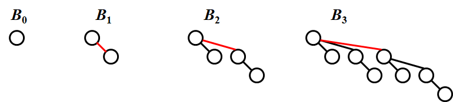

- $B_k$ consists of a root with $k$ children, which are $B_0,B_1,\cdots,B_{k-1}$.

- $B_k$ has exactly $2^k$ nodes.

- The number of nodes at depth $d$ is $C_k^d$, which is **binomial coefficient**.

- A priority queue of **any size** can be **uniquely** represented by a collection of binomial trees.

  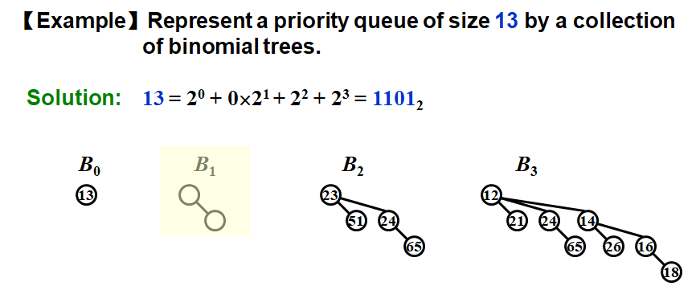

### 5.2 Operations

#### FindMin

- The minimum key is in one of the **roots**.
- There are at most $\lceil \log N\rceil$ roots, hence $T_p=O(\log N)$.

> Note: We can remember the minimum and update whenever it is changed. Then this operation will take **O(1)**.

#### Merge

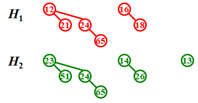

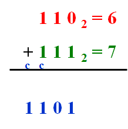

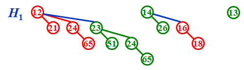

- $T_p=O(\log N)$, but must keep the trees in the binomial queue **sorted by height**.

#### Insert

- a special case for merging

> Note:
>
> - If the smallest nonexistent binomial tree is $B_i$ , then $T_p = \text{Const} \cdot(i + 1)$.
> - Performing $N$ **Inserts** on an initially empty binomial queue will take $O(N)$ worst-case time.  Hence the **average** time is **constant**.

#### DeleteMin

- Step 1: FindMin in $B_k$

  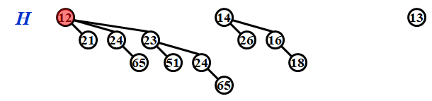
  $$
  T_p=O(\log N)
  $$
  
- Step 2: Remove $B_k$ from $H$

  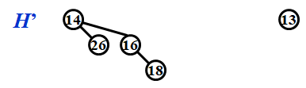
  $$
  T_p=O(1)
  $$
  
- Step 3: Remove root from $B_k$

  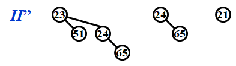
  $$
  T_p=O(\log N)
  $$
  
- Step 4: Merge($H',H''$)

  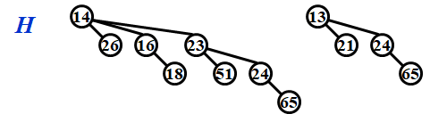
  $$
  T_p=O(\log N)
  $$

### 5.3 Implementation

- Binomial queue = **array** of binomial trees

| Operation |                  Property                   |                           Solution                           |
| :-------: | :-----------------------------------------: | :----------------------------------------------------------: |
| DeleteMin |      Find all the **subtrees** quickly      |        **Left-child-next-sibling** with linked lists         |
|   Merge   | The children are **ordered** by their sizes | The next tree will be the largest. Hence maintain the subtrees in **decreasing** sizes |

```c
typedef struct BinNode *Position;
typedef struct Collection *BinQueue;
typedef struct BinNode *BinTree;  /*missing from p.176*/

struct BinNode 
{ 
	ElementType Element;
	Position LeftChild;
	Position NextSibling;
} ;

struct Collection 
{ 
	int CurrentSize;  /*total number of nodes*/
	BinTree TheTrees[ MaxTrees ];
} ;
```

#### Combine trees

```c
BinTree CombineTrees( BinTree T1, BinTree T2 ) /*merge equal-sized T1 and T2*/
{  
	if ( T1->Element > T2->Element ) /*attach the larger one to the smaller one*/
		return CombineTrees( T2, T1 );
    
    /*insert T2 to the front of the children list of T1*/
	T2->NextSibling = T1->LeftChild;
	T1->LeftChild = T2;
	return T1;
}
```

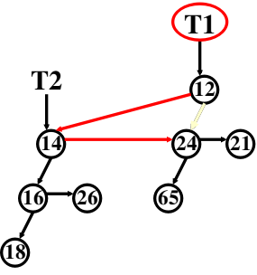
$$
T_p=O(1)
$$

#### Merge

```c
BinQueue Merge( BinQueue H1, BinQueue H2 )
{	
	BinTree T1, T2, Carry = NULL; 	
	int i, j;
	if ( H1->CurrentSize+H2->CurrentSize > Capacity ) 
        ErrorMessage();
	H1->CurrentSize += H2->CurrentSize;
	for ( i = 0, j = 1; j <= H1->CurrentSize; i++, j *= 2 ) 
    /*i and j are the index and size of the tree separately*/
    {
	    T1 = H1->TheTrees[i]; T2 = H2->TheTrees[i]; /*current trees*/
	    switch( 4*!!Carry + 2*!!T2 + !!T1 )  /*assign each digit to a tree*/
        { 
			case 0: /*000*/
	 		case 1: /*001*/  
                break;	
			case 2: /*010*/  
                H1->TheTrees[i] = T2; 
                H2->TheTrees[i] = NULL; 
                break;
			case 4: /*100*/  
                H1->TheTrees[i] = Carry; 
                Carry = NULL; 
                break;
			case 3: /*011*/  
                Carry = CombineTrees( T1, T2 );
                H1->TheTrees[i] = H2->TheTrees[i] = NULL;
                break;
			case 5: /*101*/ 
                Carry = CombineTrees( T1, Carry );
                H1->TheTrees[i] = NULL; 
                break;
			case 6: /*110*/ 
                Carry = CombineTrees( T2, Carry );
                H2->TheTrees[i] = NULL; 
                break;
			case 7: /*111*/ 
                H1->TheTrees[i] = Carry;
                Carry = CombineTrees( T1, T2 );
                H2->TheTrees[i] = NULL;
                break;
	    } /*end switch*/
	} /*end for-loop*/
	return H1;
}
```

#### DeleteMin

```c
ElementType DeleteMin( BinQueue H )
{	
    BinQueue DeletedQueue; 
	Position DeletedTree, OldRoot;
	ElementType MinItem = Infinity; /*the minimum item to be returned*/	
	int i, j, MinTree; /*MinTree is the index of the tree with the minimum item*/

	if ( IsEmpty(H) )
    {
        PrintErrorMessage();
        return –Infinity; 
    }

	for ( i = 0; i < MaxTrees; i++) /*Step 1: find the minimum item*/
    {  
	    if( H->TheTrees[i] && H->TheTrees[i]->Element < MinItem ) 
        {
            MinItem = H->TheTrees[i]->Element;
            MinTree = i;
        } /*end if*/
	} /*end for-i-loop*/
	DeletedTree = H->TheTrees[ MinTree ];  
	H->TheTrees[ MinTree ] = NULL; /*Step 2: remove the MinTree from H => H’*/ 
	OldRoot = DeletedTree; /*Step 3.1: remove the root*/ 
	DeletedTree = DeletedTree->LeftChild;
    free(OldRoot);
	DeletedQueue = Initialize(); /*Step 3.2: create H”*/ 
	DeletedQueue->CurrentSize = ( 1<<MinTree ) – 1;  /*2^MinTree – 1*/
	for ( j = MinTree–1; j >= 0; j–– ) 
    {  
	    DeletedQueue->TheTrees[j] = DeletedTree;
	    DeletedTree = DeletedTree->NextSibling;
	    DeletedQueue->TheTrees[j]->NextSibling = NULL;
	} /*end for-j-loop*/
	H->CurrentSize  –= DeletedQueue->CurrentSize+1;
	H = Merge( H, DeletedQueue ); /*Step 4: merge H’ and H”*/ 
	return MinItem;
}
```

### 5.4 Amortized Analysis

- The worst case time for each insertion is $O(\log N)$.
- A binomial queue of $N$ elements can be built by **$N$ successive insertions** in $O(N)$ time.

#### Aggregate method

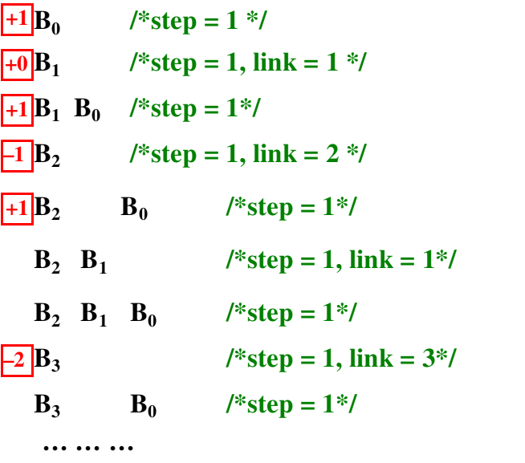

- Total steps = $N$
- Total links = $N(\frac14+2\cdot\frac18+3\cdot\frac1{16}+\cdots)=O(N)$

#### Potential method

- An insertion that costs $c$ units results in a net increase of $2 – c$ trees in the forest.

- $C_i$ = cost of the $i$th insertion

- $\Phi_i$ = number of trees after thr $i$th insertion($\Phi_0=0$)

- $C_i+(\Phi_i-\Phi_{i-1})=2$ for all $i=1,2,\cdots,N$

- Add all the equations up: 
  $$
  \sum^N_{i=1}C_i+\Phi_i-\Phi_0=2N
  $$

  $$
  \sum^N_{i=1}C_i=2N-\Phi_N\leq 2N=O(N)
  $$

- $T_{worst}=O(\log N)$, but $T_{amortized}=2$