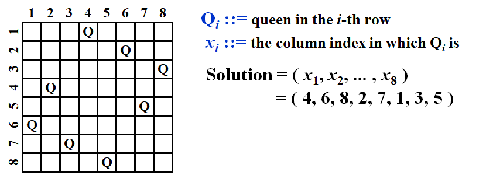
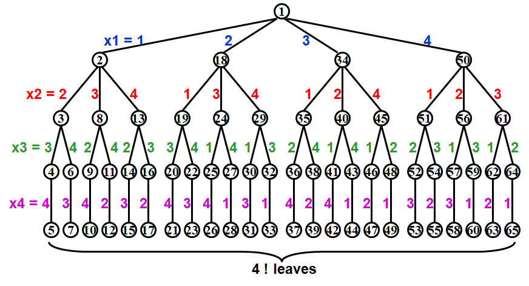
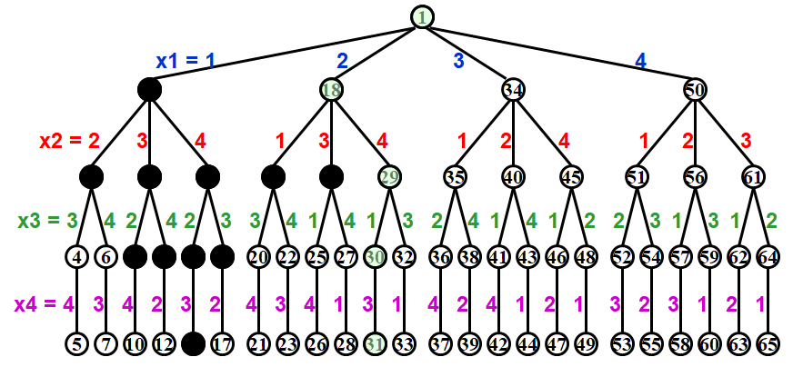
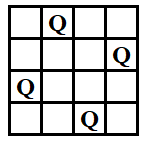
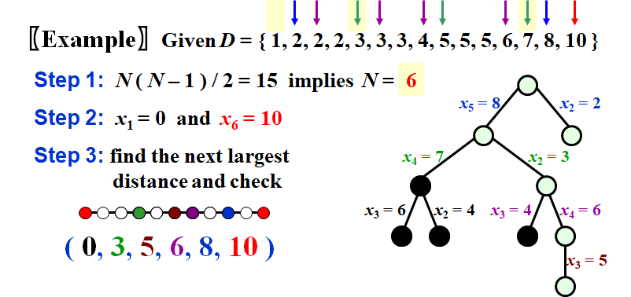
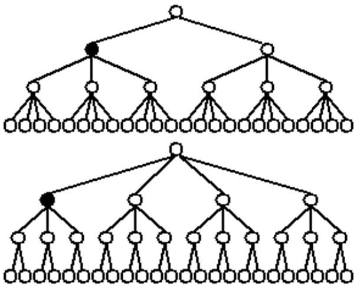

# WEEK 6

## 6 Backtracking

### 6.1 Rationale of the Backtracking Algorithms

- A sure-fire way to find the answer to a problem is to **make a list of all candidate answers**, **examine each**, and following the examination of all or some of the candidates, declare the identified answer

- If the list is finite and it is possible to identify the answer following the examinations. And, if there are **not too many** candidates
- Backtracking enables us to **eliminate** the explicit examination of **a large subset** of the candidates while still guaranteeing that the answer will be found if the algorithm is run to termination
- pruning(剪枝)
- The basic idea is that suppose we have a partial solution $( x_1, \cdots , x_i )$ where each $x_k \in S_k$ for  $1 \leq k \leq i < n$.   First we add  $x_{i+1}\in S_{i+1}$ and check if $( x_1, \cdots , x_i ,x_{i+1})$ satisfies the constrains.  If the answer is “yes” we continue to add the next x, else we delete $x_i$ and backtrack to the previous partial solution $( x_1, \cdots , x_{i-1} )$

### 6.2 Eight Queens

- Find a placement of  8 queens on an $8 \times 8$ chessboard such that no two queens attack
- Two queens are said to attack if they are in the same row, column, diagonal, or antidiagonal of the chessboard



- Constraints

  - $S_i=\{1,2,3,4,5,6,7,8\}$ for $1\leq i\leq 8$

    > Note: This implies $8^8$ candidates in the solution space

  - $x_i\neq x_j$ if $i\neq j$

    > Note: This implies that the solution must be a permutation of $1, 2, \cdots , 8$. Thus the number of candidates in the solution space is reduced to $8!$

  - $(x_i-x_j)/(i-j)\neq \pm 1$

- For the problem with $n$ queens, there are $n!$ candidates in the solution space

- Method: Take the problem of 4 queens as an example

  - Step1: Construct a game tree

    

    Each path from the root to a leaf defines an element of the solution space

  - Step2: Each path from the root to a leaf defines an element of the solution space

    

    

    > Note: No tree is actually constructed.  The game tree is just an abstract concept

### 6.3 The Turnpike Reconstruction Problem

- Given $N$ points on the x-axis with coordinates $x_1 <  x_2 <\cdots < x_N$ .  Assume that $x_1 = 0$.  There are $N ( N – 1 ) / 2$ distances between every pair of points
- Given $N ( N – 1 ) / 2$ distances.  Reconstruct a point set from the distances



```c
bool Reconstruct (DistType X[ ], DistSet D, int N, int left, int right)
{ /* X[1]...X[left-1] and X[right+1]...X[N] are solved */
	bool Found = false;
    if (Is_Empty(D))
        return true; /* solved */
    D_max = Find_Max(D);
    /* option 1：X[right] = D_max */
    /* check if |D_max-X[i]| in D is true for all X[i]’s that have been solved */
    OK = Check( D_max, N, left, right ); /* pruning */
    if (OK) /* add X[right] and update D */
    { 
        X[right] = D_max;
        for (i=1; i<left; i++) Delete(|X[right]-X[i]|, D);
        for (i=right+1; i<=N; i++) Delete(|X[right]-X[i]|, D);
        Found = Reconstruct(X, D, N, left, right-1);
        if (!Found) 
        { /* if does not work, undo */
            for (i=1; i<left; i++) Insert(|X[right]-X[i]|, D);
            for (i=right+1; i<=N; i++) Insert(|X[right]-X[i]|, D);
        }
    }
    /* finish checking option 1 */
    if (!Found) /* if option 1 does not work */
    { 
        /* option 2: X[left] = X[N]-D_max */
        OK = Check(X[N]-D_max, N, left, right);
        if (OK) 
        {
            X[left] = X[N]–D_max;
            for (i=1; i<left; i++) Delete(|X[left]-X[i]|, D);
            for (i=right+1; i<=N; i++) Delete(|X[left]-X[i]|, D);
            Found = Reconstruct (X, D, N, left+1, right);
            if (!Found) 
            {
                for (i=1; i<left; i++) Insert(|X[left]-X[i]|, D);
                for (i=right+1; i<=N; i++) Insert(|X[left]-X[i]|, D);
            }
        }
        /* finish checking option 2 */
    } /* finish checking all the options */  
    return Found;
}
```

### 6.4 A Template

```pseudocode
bool Backtracking (int i)
{   
	Found = false;
    if (i > N)
        return true; /* solved with (x1, …, xN) */
    for ( each xi in Si ) /* check if satisfies the restriction R */
    { 
        
        OK = Check((x1, …, xi) , R); /* pruning */
        if ( OK ) 
        {
            Count xi in;
            Found = Backtracking(i+1);
            if (!Found) Undo( i ); /* recover to (x1, …, xi-1) */
        }
        if (Found) break; 
    }
    return Found;
}
```

- 回溯的效率跟S的规模、约束函数的复杂性、满足约束条件的结点数相关

- 约束函数决定了剪枝的效率，但是如果函数本身太复杂也未必合算

- 满足约束条件的结点数最难估计，使得复杂度分析很难完成

- When different $S_i$’s have different sizes

  

  Smaller $S_i$ first so we can cut a larger subtree if one doesn’t work