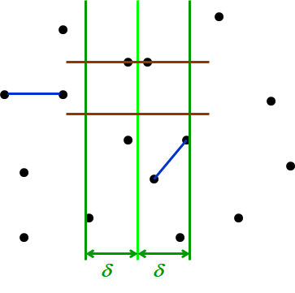
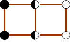
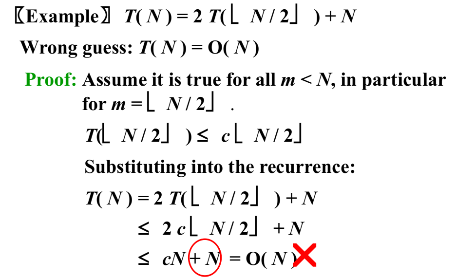
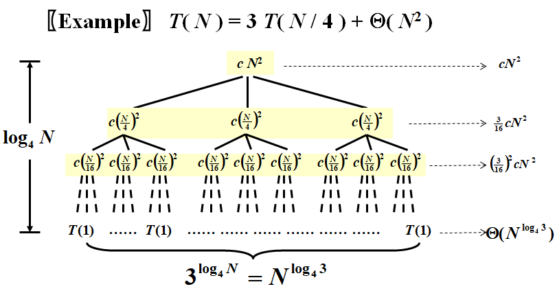
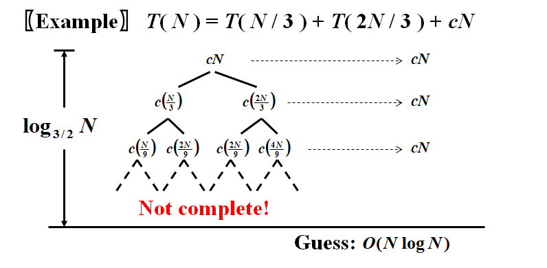
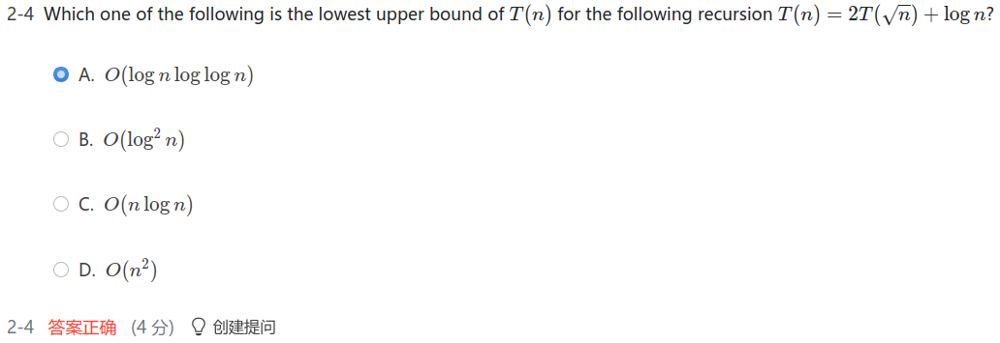

# WEEK 7

## 7 Divide and Conquer

### 7.1 Introduction

- Recursively:
  - **Divide** the problem into a number of sub-problems
  - **Conquer** the sub-problems by solving them recursively
  - **Combine** the solutions to the sub-problems into the solution for the original problem

- General recurrence: $T(N)=aT(N/b)+f(N)$
- Cases solved by divide and conquer
  - The maximum subsequence sum – the $O( N\log N )$ solution
  - Tree traversals – $O( N )$
  - Mergesort and quicksort –  $O( N\log N ) $

### 7.2 Closest Points Problem

- Given $N$ points in a plane.  Find the **closest pair** of points.  (If two points have the same position, then that pair is the closest with distance 0.)

#### Simple Exhaustive Search

- Check $N(N-1)/2$ pairs of points
- $T=O(N^2)$

#### Divide and Conquer

- Step1: Sort according to x-coordinates and divide
- Step2: Conquer by forming a solution from left, right, and cross

$$
T(N)=2T(N/2)+cN=2^2T(N/2^2)+2cN=\cdots=2^kT(N/2^k)+kcN=N+cN\log N=O(N\log N)
$$

$$
T(N)=2T(N/2)+cN^2=2^2T(N/2^2)+cN^2(1+1/2)=\cdots=2^kT(N/2^k)+cN^2(1+1/2+\cdots+1/2^{k-1})=O(N^2)
$$

#### $\delta$-strip

- $\delta$ is the smallest distance



- If NumPointInStrip = $O(\sqrt N)$, we have

  ```c
  /* points are all in the strip */
  for (i = 0; i < NumPointsInStrip; i++)
      for (j = i+1; j < NumPointsInStrip; j++) 
          if (Dist(Pi, Pj) < delta)
  			delta = Dist(Pi, Pj);
  ```

  The worst case: NumPointInStrip = N

- Consider both vertical and horizontal $\delta$-strip

  ```c
  /* points are all in the strip */
  /* and sorted by y coordinates */
  for (i = 0; i < NumPointsInStrip; i++)
      for (j = i+1; j < NumPointsInStrip; j++) 
          if ( Dist_y(Pi, Pj) > delta)
  			break;
          else if (Dist(Pi, Pj) < delta)
  	 		delta = Dist(Pi, Pj);
  ```

  The worst case: 8 points sitting all at corners

  

  For any $p_i$, at most 7 points are considered

- $f(N)=O(N)$

### 7.3 Three methods for solving recurrences

- $T(N)=aT(N/b)+f(N)$
- Details to be ignored:
  - if $(N/b)$ is an integer or not
  - always assume $T(n)=\Theta(1)$ for small $n$

#### Substitution Method

- guess, then prove by induction

- Example: $T(N)=2T(\lfloor N/2\rfloor)+N$

  - Guess: $T(N)=O(N\log N)$

  - Proof: Assume it is true for all $m<N$, in particular for $m=\lfloor N/2\rfloor$

    Then there exists a constant $c > 0$ so that $T(\lfloor N/2\rfloor)\leq c\lfloor N/2\rfloor\log\lfloor N/2\rfloor$

    Substituting into the recurrence:

    $$
    T(N)=2T(\lfloor N/2\rfloor)+N\leq2c\lfloor N/2\rfloor\log\lfloor N/2\rfloor+N\leq cN(\log N-\log2)+N\leq cN\log N(c\geq1)
    $$
  
- Must prove the **exact form**

  

#### Recursion-tree Method


$$
T(N)=\sum^{\log_4N-1}_{i=0}(\frac3{16})^icN^2+\Theta(N^{\log_43})<\sum^\infin_{i=0}(\frac3{16})^icN^2+\Theta(N^{\log_43})=\frac{cN^2}{1-3/16}+\Theta(N^{\log_43})=O(N^2)
$$



- Proof by substitution:
  $$
  T(N)=T(N/3)+T(2N/3)+cN\\\leq d(N/3)\log(N/3)+d(2N/3)\log(2N/3)+cN\\=dN\log N-dN(\log_23-2/3)+cN\\\leq dN\log N(d\geq c/(\log_23-2/3))
  $$


#### Master Method

##### [Master Theorem] Let $a\geq 1$ and $b > 1$ be constants, let $f(N)$ be a function, and let $T(N)$ be defined on the nonnegative integers by the recurrence $T(N)=aT(N/b)+f(N)$, then:

1. If $f(N)=O(N^{\log_b {a-\delta}})$ for some constant $\delta>0$, then $T(N)=\Theta(N^{\log_b a})$
3. If $f(N)=\Omega(N^{\log_b a+\delta})$ for some constant $\delta>0$, and if $af(N/b)<cf(N)$ for some constant $c<1$ and all sufficiently large $N$, then $T(N)=\Theta(f(N))$
3. If $f(N)=\Theta(N^{\log_ba})$, then $T(N)=\Theta(N^{\log_b a}\log N)$

- Master Method cannot cover all the cases of $f(N)$

##### [Master Theorem] The recurrence $T(N)=aT(N/b)+f(N)$ can be solved as follows:

1. If $af(N/b)=kf(N)$ for some constant $k<1$, then $T(N)=\Theta(f(N))$
2. If $af(N/b)=Kf(N)$ for some constant $K>1$, then $T(N)=\Theta(N^{\log_b a})$
3. If $af(N/b)=f(N)$, then $T(N)=\Theta(f(N)\log_b N)$

##### [Theorem] The solution to the equation $T(N)=aT(N/b)+\Theta(N^k\log^pN)$ where $a\geq1$, $b>1$ and $p\geq0$ is

$$
T(N) =
        \begin{cases}
        O(N^{\log_b a})  & \text{if $a>b^k$} \\
        O(N^k\log^{p+1}N) & \text{if $a=b^k$} \\
        O(N^k\log^pN) & \text{if $a<b^k$}
        \end{cases}
$$



