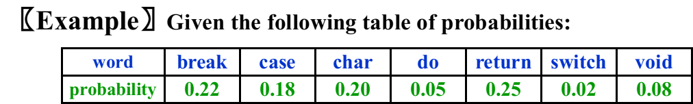
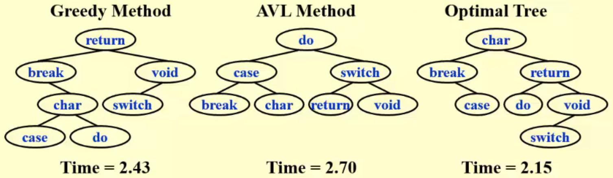
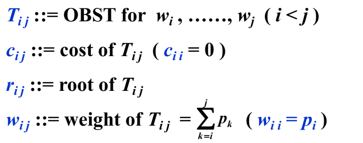
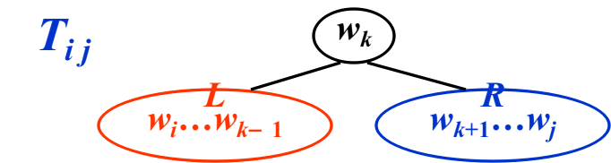
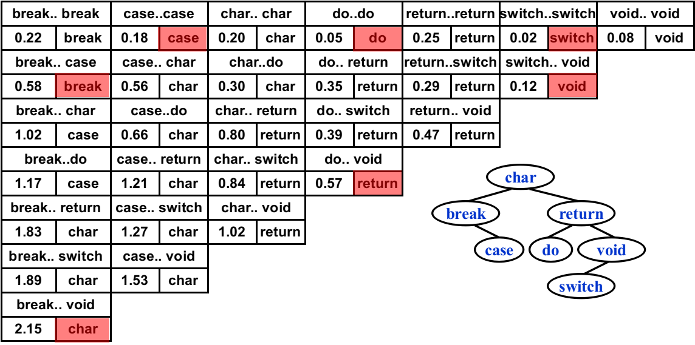

# WEEK 8

## 8 Dynamic Programming

- Solve sub-problems just once and save answers in a **table**
- Use a **table** instead of **recursion**

### 8.1 Fibonacci Numbers

$$
F(N)=F(N-1)+F(N-2)
$$

```c
int Fib(int N) 
{ 
    if (N <= 1) return 1; 
    else return Fib(N-1)+Fib(N-2); 
}
```

$$
T(N)\geq T(N-1)+T(N-2)\rarr T(N)\geq F(N)
$$


- **Trouble maker**: The growth of redundant calculations is explosive.
- **Solution**: Record the two most recently computed values to avoid recursive calls.

```c
int Fibonacci(int N) 
{   
	int i, Last, NextToLast, Answer; 
    if (N <= 1)  return 1; 
    Last = NextToLast = 1;    /*F(0) = F(1) = 1*/
    for (i = 2; i <= N; i++) 
    { 
        Answer = Last+NextToLast;   /*F(i) = F(i-1) + F(i-2)*/
        NextToLast = Last; 
        Last = Answer;  /*update F(i-1) and F(i-2)*/
    }  /* end-for */
    return Answer; 
}
```

$$
T(N)=O(N)
$$

### 8.2 Ordering Matrix Multiplications

- The problem is to find the **order** that we can compute the product of $n$ matrices with **minimal computing time**
- Let $b_n$ = number of different ways to compute  $M_1\cdot M_2\cdots M_n$. Then we have  $b_2 = 1, b_3 = 2, b_4 = 5,\cdots$ 
- Let $M_{ij}=M_i\cdots M_j$. Then $M_{1n}=M_1\cdots M_n=M_{1i}\cdot M_{i+1n}$
- Catalan number

$$
b_n=\sum^{n-1}_{i=1}b_ib_{n-i}=O(\frac{4^n}{n\sqrt n})\quad\text{where $n>1$ and $b_1=1$}
$$

- Suppose we are to multiply $n$ matrices $M_1\cdots M_n$ where $M_i$ is an $r_{i-1}\times r_i$ matrix. Let $m_{ij}$ be the cost of the optimal way to compute $M_1\cdots M_n$ where $M_i$. Then we have the recurrence equations:
  $$
  m_{ij}=
  \begin{cases}
          0,  & \text{if $i=j$} \\
          \min_{i\leq l<j}\{m_{il}+m_{l+1j}+r_{i-1}r_lr_j\}, & \text{if $i<j$}
          \end{cases}
  $$
  
- There are only $O(N^2)$ values of $M_{ij}$

- If $j-i=k$, then the only values $M_{xy}$ required to compute $M_{ij}$ satisfy $y-x<k$

```c
/*r contains number of columns for each of the N matrices*/ 
/*r[0] is the number of rows in matrix 1*/ 
/*Minimum number of multiplications is left in M[1][N]*/
void OptMatrix(const long r[ ], int N, TwoDimArray M) 
{   
    int i, j, k, L; 
    long ThisM; 
    for(i = 1; i <= N; i++)  M[i][i] = 0; 
    for(k = 1; k < N; k++) /*k = j-i*/ 
        for(i = 1; i <= N-k; i++) /* For each position */ 
        { 
			j = i + k;    
            M[i][j] = Infinity; 
			for( L = i; L < j; L++ ) 
            { 
	    		ThisM = M[ i ][ L ] + M[ L + 1 ][ j ] + r[ i - 1 ] * r[ L ] * r[ j ]; 
	    		if ( ThisM < M[ i ][ j ] )  /* Update min */ 
					M[ i ][ j ] = ThisM; 
			}  /* end for-L */
        }  /* end for-Left */
}
```

$$
T(N)=O(N^3)
$$

### 8.3 Optimal Binary Search Tree

- The best for static searching (without insertion and deletion)

- Given  $N$  words  $w_1 < w_2 < \cdots < w_N$, and the probability of searching for each $w_i$ is $p_i$. Arrange these words in a binary search tree in a way that minimize the expected total access time
  $$
  T(N)=\sum^N_{i=1}p_i\cdot(1+d_i)
  $$








$$
c_{ij}=p_k+\text{cost}(L)+\text{cost}(R)+\text{weight}(L)+\text{weight}(R)\\
=p_k+c_{i,k-1}+c_{k+1,j}+w_{i,k-1}+w_{k+1,j}=w_{ij}+c_{i,k-1}+c_{k+1,j}
$$

- $T_{ij}$ is optimal $\rarr$ $r_{ij}=k$ such that $c_{ij}=\min_{i<l\leq j}\{w_{ij}+c_{i,l-1}+c_{l+1,j}\}$


$$
T(N)=O(N^3)
$$

### 8.4 Floyd Shortest Path Algorithm

- For all pairs of $v_i$ and $v_j ( i \neq j )$, find the shortest path between.

#### Method 1

- Use **single-source algorithm**  for **|V|** times
- $T=O(|V|^3)$ —— works fast on sparse graph

#### Method 2

-  Define $D^k[i][j]=\min\{\text{length of path }i\rarr\{l\leq k\}\rarr j\}$ and $D^{-1}[i][j]=\text{Cost}[i][j]$. Then the length of the shortest path from $i$ to $j$ is $D^{N-1}[i][j]$

##### Algorithm

- Start from $D^{-1}$ and successively generate $D^0,D^1,\cdots,D^{N-1}$. If $D^{k-1}$ is done, then either
  - $k\notin$ the shortest path $i\rarr\{l\leq k\}\rarr j$, then $D^k=D^{k-1}$
  - $k\in$ the shortest path $i\rarr\{l\leq k\}\rarr j = \{\text{the shortest path from $i$ to $k$}\}\cup\{\text{the shortest path from $k$ to $j$}\}$, then $D^k[i][j]=D^{k-1}[i][k]+D^{k-1}[k][j]$
- $D^k[i][j]=\min\{D^{k-1}[i][j],D^{k-1}[i][k]+D^{k-1}[k][j]\},k\geq0$

```c
/*A[ ] contains the adjacency matrix with A[i][i] = 0*/ 
/*D[ ] contains the values of the shortest path*/ 
/*N is the number of vertices*/ 
/*A negative cycle exists iff D[i][i] < 0*/ 
void AllPairs(TwoDimArray A, TwoDimArray D, int N) 
{   
    int  i, j, k; 
    for (i = 0; i < N; i++)  /*Initialize D*/ 
         for(j = 0; j < N; j++)
			D[i][j] = A[i][j]; 
    for(k = 0; k < N; k++)  /*add one vertex k into the path*/
    	for(i = 0; i < N; i++) 
			for(j = 0; j < N; j++) 
	    		if(D[i][k]+D[k][j] < D[i][j])
                    D[i][j] = D[i][k]+D[k][j]; /* Update shortest path */ 
}
```

- $T(N)=O(N^3)$, but faster in a dense graph.

### 8.5 Design a DP method

- Characterize an optimal solution
- Recursively define the optimal values
- Compute the values in some order
- Reconstruct the solving strategy