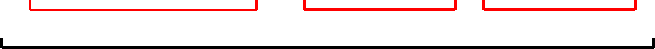
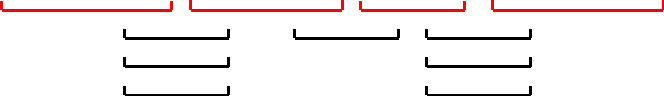
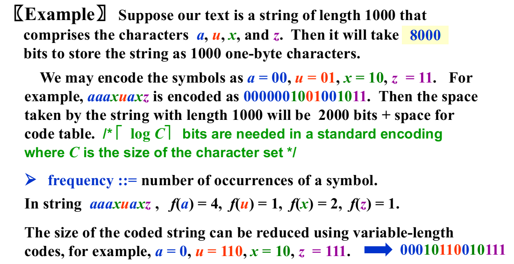
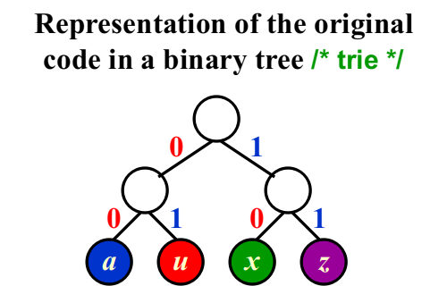
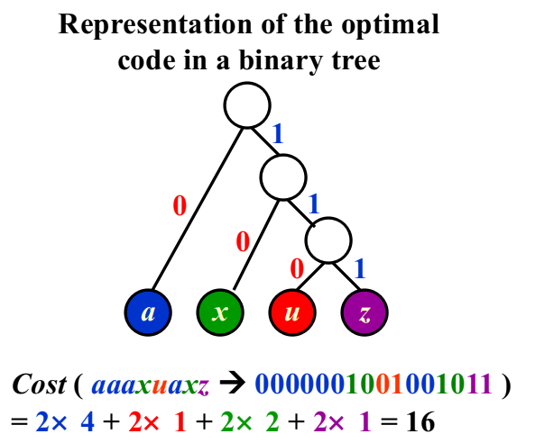

# WEEK 9

## 9 Greedy Method

### 9.1 Introduction

- **Optimization Problems:** Given a set of **constraints** and an **optimization function**.  Solutions that satisfy the constraints are called **feasible solutions**.  A feasible solution for which the optimization function has the best possible value is called an **optimal solution**.
- **The Greedy Method:** Make the **best** decision at each stage, under some **greedy criterion**.  A decision made in one stage is **not changed** in a later stage, so each decision should **assure feasibility**.

> Note: 
>
> - Greedy algorithm works only if the **local optimum** is equal to the **global optimum**.
> - Greedy algorithm **does not** guarantee optimal solutions.  However, it generally produces solutions that are very close in value (**heuristics**) to the optimal, and hence is intuitively appealing when finding the optimal solution takes too much time.

### 9.2 Activity Selection Problem

- Given a set of activities $S = { a_1, a_2, \cdots, a_n }$ that wish to use a resource. Each $a_i$ takes place during a time interval $[s_i, f_i)$.
- Activities $a_i$ and $a_j$ are **compatible** if $s_i \geq f_j$ or $s_j \geq f_i$ (i.e. their time intervals do not overlap).
- **Target**: Select a maximum-size subset of mutually compatible activities.

#### Greedy criterion

##### Greedy Rule 1

- Select the interval which **starts earliest** (but not overlapping the already chosen intervals)

- Counterexample:

  

##### Greedy Rule 2

- Select the interval which is the **shortest** (but not overlapping the already chosen intervals)

- Counterexample:

  

##### Greedy Rule 3

- Select the interval with the fewest conflicts with other remaining intervals (but not overlapping the already chosen intervals)

- Counterexample:

  

##### Greedy Rule 4

- Select the interval which **ends first** or **starts latest** (but not overlapping the already chosen intervals)
- Resource become free as soon as possible

- Correctness:
  - Algorithm gives non-overlapping intervals
  - The result is optimal

##### [Theorem] Consider any nonempty subproblem $S_k$, and let $a_m$ be an activity in $S_k$ with the earliest finish time.  Then $a_m$ is included in some maximum-size subset of mutually compatible activities of $S_k$.

- Proof:
  - Let $A_k$be the optimal solution set, and $a_{ef}$ is the activity in $A_k$ with the earliest finish time.
  - If $a_m$ and $a_{ef}$ are the same, we are done, else replace $a_{ef}$ by $a_m$ and get $A_k’$.
  - Since $f_m \leq f_{ef}$, $A_k’$ is another optimal solution.

- Implementation:
  - Select the first activity; Recursively solve for the rest.
  - Remove tail recursion by iterations.
  - $T(N)=O(N\log N)$ to sort the end time or start time.

#### Elements of the Greedy Strategy

- Cast the optimization problem as one in which we **make a choice** and are left with **one subproblem** to solve.
- Prove that there is always **an optimal solution** to the original problem that makes the **greedy choice**, so that the greedy choice is always safe.
- Demonstrate **optimal substructure** by showing that, having made the greedy choice, what remains is a subproblem with the property that if we combine an **optimal solution to the subproblem** with the **greedy choice** we have made, we arrive at an **optimal solution to the original problem**.

> Note: Beneath every greedy algorithm, there is almost always a more cumbersome(麻烦的) dynamic-programming solution

### 9.3 Huffman Codes



> Note: If all the characters occur with the same frequency, then there are not likely to be any savings.

- If character $C_i$ is at depth $d_i$ and occurs  $f_i$ times, then the **cost** of the code = $\sum d_i f_i$ .





- The trick is: No code is a **prefix** of another.

- Any sequence of bits can always be decoded unambiguously if the characters are placed only at the leaves of a **full tree**(all nodes are leaves or have two children), such kind of code is called **prefix code**.

- Huffman’s Algorithm

  ```pseudocode
  void Huffman ( PriorityQueue  heap[ ],  int  C )
  {   consider the C characters as C single node binary trees,
       and initialize them into a min heap;
       for ( i = 1; i < C; i++ ) { 
          create a new node;
          /* be greedy here */
          delete root from min heap and attach it to left_child of node;
          delete root from min heap and attach it to right_child of node;
          weight of node = sum of weights of its children;
          /* weight of a tree = sum of the frequencies of its leaves */
          insert node into min heap;
     }
  }
  ```

  $$
  T=O(C\log C)
  $$

  

