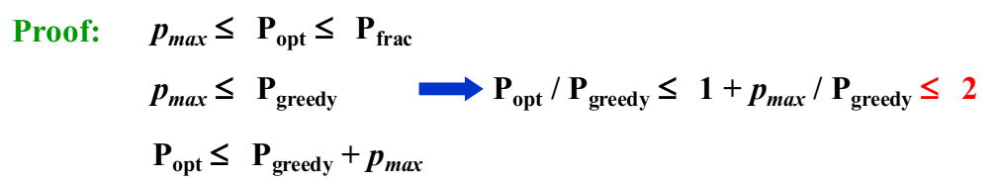
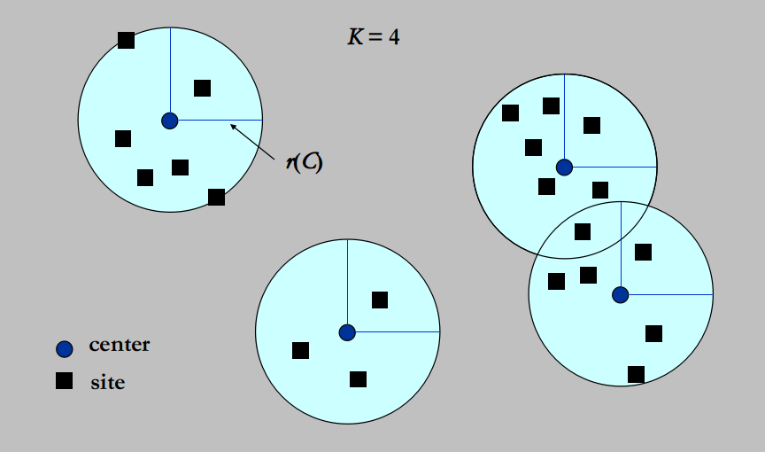

# WEEK 11

## 11 Approximation

### 11.1 Introduction

- Dealing with HARD problems
- Getting around NP-completeness
  - If $N$ is small, even $O(2^N)$ is acceptable
  - Solve some important special cases in polynomial time
  -  Find **near-optima**l solutions in polynomial time --- **approximation** algorithm

> Note: greedy等heuristics不管效果，approximation有近似解的质量方面的讨论

#### Approximation Ratio

##### [Definition] An algorithm has an *approximation ratio* of  $\rho(n)$ if, for any input of size $n$, the cost $C$ of the solution produced by the algorithm is within a factor of $\rho(n)$ of the cost $C^*$ of an optimal solution:

$$
\max\left(\frac{C}{C^*},\frac{C^*}{C}\right)\leq\rho(n)
$$

- If an algorithm achieves an approximation ratio of $\rho(n)$, we call it a **$\rho(n)$-approximation algorithm**.

##### [Definition] An *approximation scheme* for an optimization problem is an approximation algorithm that takes as input not only an instance of the problem, but also a value $\epsilon > 0$ such that for any fixed $\epsilon$, the scheme is a *$(1+ \epsilon)$-approximation algorithm*.

- We say that an approximation scheme is a **polynomial-time approximation scheme(PTAS)** if for any fixed $\epsilon > 0$, the scheme runs in time polynomial in the size $n$ of its input instance.

- $O((1/\epsilon)^2n^3)$ is a **fully** polynomial-time approximation scheme(FPTAS)

  > Note: fully 的意思是关于$(1/\epsilon)$和$n$都是多项式级的

### 11.2 Approximate Bin Packing

- Given $N$ items of sizes  $S_1 , S_2 , \cdots, S_N$ , such that $0 < S_i \leq 1$ for all $1 \leq i \leq N$. Pack these items in the **fewest** number of bins, each of which has **unit capacity**.


- NP-Hard
- Decision problem: given $K$ bins, can we pack $N$ items? --- NPC

#### Next Fit

```pseudocode
void NextFit ( )
{   read item1;
    while ( read item2 ) {
        if ( item2 can be packed in the same bin as item1 )
	place item2 in the bin;
        else
	create a new bin for item2;
        item1 = item2;
    } /* end-while */
}
```

##### [Theorem] Let $M$ be the optimal number of bins required to pack a list $I$ of items.  Then *next fit* never uses more than $2M – 1$ bins.  There exist sequences such that *next fit* uses $2M  – 1$ bins.

##### A simple proof for Next Fit

- If Next Fit generates $2M$(or $2M+1$) bins, then the optimal solution must generate at least $M+1$ bins.

- Let $S ( B_i )$ be the size of the $i$th bin.  Then we must have:
  $$
  S(B_1)+S(B_2)>1\\
  S(B_3)+S(B_4)>1\\
  \cdots\\
  S(B_{2M-1})+S(B_{2M})>1\\
  \rarr\sum_{i=1}^{2M}S(B_i)>M
  $$

- The **optimal solution** needs at least  $\lceil\text{total size of all the items / 1}\rceil$ bins
  $$
  \lceil\text{total size of all the items / 1}\rceil=\lceil\sum_{i=1}^{2M}S(B_i)\rceil\geq M+1
  $$

#### First Fit

```pseudocode
void FirstFit ( )
{   
	while ( read item ) 
	{
        scan for the first bin that is large enough for item;->Can be implemented in O(NlogN)
        if ( found ) place item in that bin;
        else create a new bin for item;
    } /* end-while */
}
```

##### [Theorem] Let $M$ be the optimal number of bins required to pack a list I of items.  Then first fit never uses more than $17M / 10$ bins.  There exist sequences such that first fit uses $17(M – 1) / 10$ bins.

#### Best Fit

- Place a new item in the **tightest** spot among all bins.

- $T = O( N \log N )$ and bin no. $\leq 1.7M$  

#### On-line Algorithms

- Place an item before processing the next one, and can **NOT change** decision.

- Never know when the input might end.  
- No on-line algorithm can always give an optimal solution.

##### [Theorem] There are inputs that force any on-line bin-packing algorithm to use at least 5/3 the optimal number of bins.

#### Off-line Algorithms

- View the **entire** item list before producing an answer.
- Trouble-maker:  The large items
- Solution:  Sort the items into non-increasing sequence of sizes. Then apply first (or best) fit --- **first**(or **best**) fit decreasing.

##### [Theorem] Let $M$ be the optimal number of bins required to pack a list $I$ of items.  Then *first fit decreasing* never uses more than $11M / 9 + 6/9$ bins.  There exist sequences such that *first fit decreasing* uses $11M / 9 + 6/9$ bins.

- Simple greedy heuristics can give good results

### 11.3 The Knapsack Problem

#### Fractional version

- A knapsack with a capacity $M$ is to be packed. Given $N$ items. Each item $i$ has a weight $w_i$ and a profit $p_i$. If $x_i$ is the percentage of the item $i$ being packed, then the packed profit will be $p_i x_i$.

- An **optimal packing** is a feasible one with **maximum profit**. That is, we are supposed to find the values of $x_i$ such that $\sum_{i=1}^np_ix_i$ obtains its maximum under the constrains
  $$
  \sum_{i=1}^n w_ix_i\leq M\,\text{and}\,x_i\in[0,1]\,\text{for}\,1\leq i\leq n
  $$

- Solution: 

  - We must pack one item into the knapsack in each stage
  - We shall be greedy on the criterion that choose maximum profit density $p_i/w_i$ for each stage.

#### 0-1 version

- $x_i$ is either 0 or 1

- NP-Hard

##### A Greedy Solution

- greedy on taking the maximum profit or profit density

- The approximation ratio is 2

  

##### A Dynamic Programming Solution

- $W_{i,p} =$ the minimum weight of a collection from $\{1, \cdots, i\}$ with total profit being exactly $p$

  1. take $i$: $W_{i,p}=w_i+W_{i-1,p-p_i}$
  2. skip $i$: $W_{i,p}=W_{i-1,p}$
  3. impossible to get $p$: $W_{i,p}=\infin$

  $$
  W_{i,p}=
  \begin{cases}
  	\infin,&i=0\\
  	W_{i-1,p},&p_i>p\\
  	\min\{W_{i-1,p},w_i+W_{i-1,p-p_i}\},&\text{otherwise}
  \end{cases}\\
  i=1,\cdots,n\\
  p=1,\cdots,np_{max}\\
  \rarr O(n^2p_{max})
  $$

> Note: input size包括$p_{max}$的二进制编码长度$d$，所以$p_{max}=O(2^d)$是指数级的复杂度

- If $p_{max}$ is very large, we can round all profit values up to lie in smaller range
- $(1+\epsilon)P_{alg}\leq P$ for any feasible solution $P$, $\epsilon$ is a precision parameter

### 11.4 $K$-center Problem



- Input: Set of $n$ sites $s_1, \cdots, s_n$
- Center selection problem: Select $K$ centers $C$ so that the maximum distance from a site to the nearest center is minimized.

- distance
  - Identity: $dist(x,x)=0$
  - Symmetry: $dist(x,y)=dist(y,x)$
  - Triangle inequality: $dist(x,y)\leq dist(x,z)+dist(z,y)$
- $dist(s_i,C)=\min_{c\in C} {dist(s_i,c)}=$ distance from $s_i$ to the closest center

- $r(C)=\max_idist(s_i,C)=$ smallest covering radius
- Task: Find a set of centers $C$ that minimizes $r(C)$, subject to $|C| = K$.
- Number of candidate centers $=\infin$

#### A Greedy Solution

- Put the first center at the **best possible** location for a single center, and then keep adding centers so as to **reduce the covering radius** each time by as much as possible.
