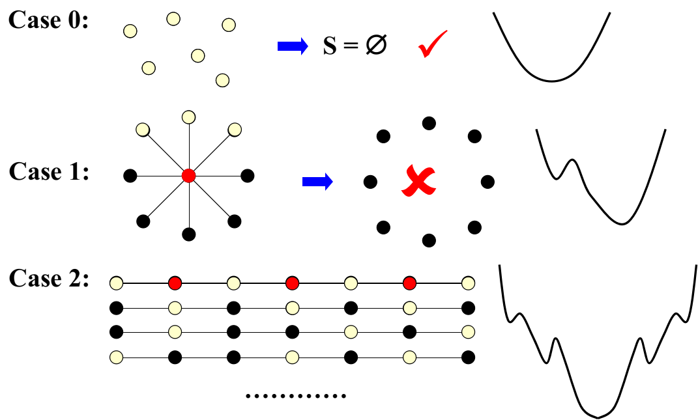
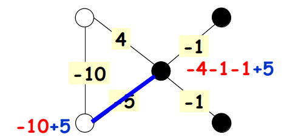
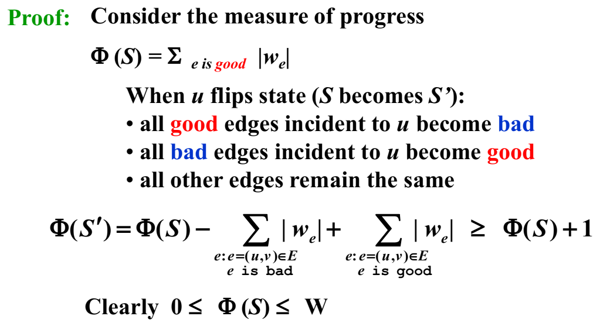
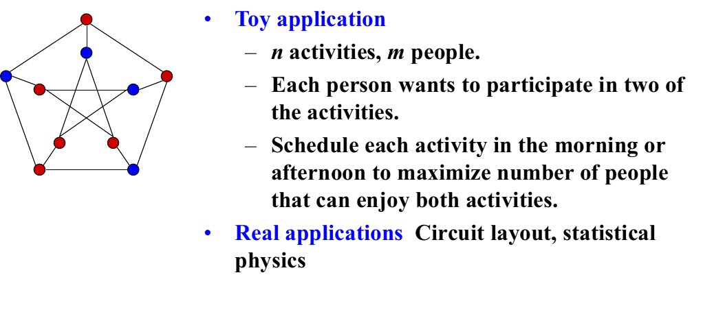
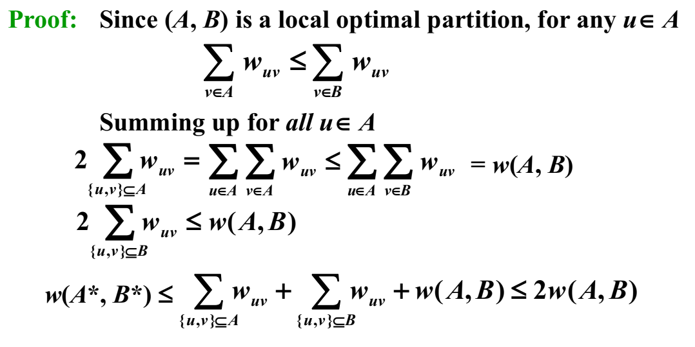
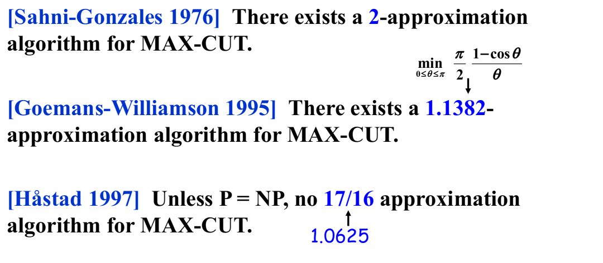
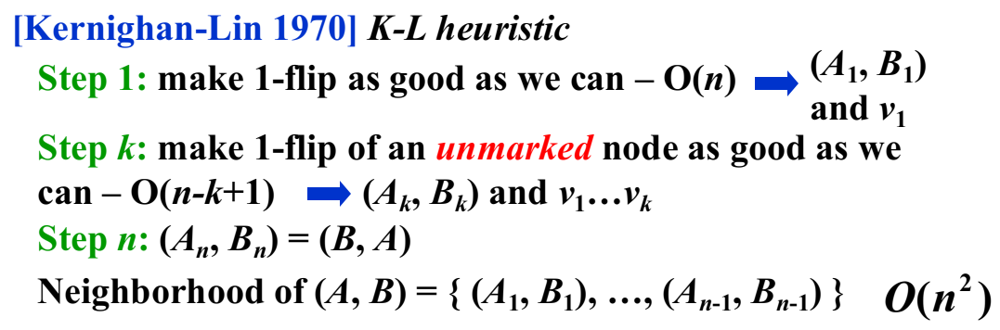

# WEEK 12

## 12 Local Search

### 12.1 Introduction

- Solve problems **approximately** - aims at a **local** optimum

#### Framework of Local Search

- Local
  - Define neighborhoods in the feasible set
  - A **local optimum** is a best solution in a neighborhood
- Search
  - Start with a feasible solution and search a better one within the neighborhood
  - A local optimum is achieved if no improvement is possible

#### Neighbor Relation

- S ~ S': ​S'​ is a **neighboring solution** of S, S' can be obtained by a small modification of S

- N(S): neighborhood of S, the set { S': S ~ S' }

- 梯度下降法

  ```pseudocode
  SolutionType Gradient_descent()
  {   
  	Start from a feasible solution S in FS ;
      MinCost = cost(S);
      while (1) 
      {
          S’ = Search(N(S)); /*find the best S’ in N(S)*/
          CurrentCost = cost(S’);
          if ( CurrentCost < MinCost ) 
          {
              MinCost = CurrentCost;    
              S = S’;
          }
          else  break;
      }
      return S;
  }
  ```

### 12.2 Vertex Cover

- Vertex cover problem: Given an undirected graph $G = (V, E)$ and an integer $K$, does $G$ contain a subset $V' \subseteq V$ such that $|V'|$ is (at most) $K$ and every edge in $G$ has a vertex in $V'$ (vertex cover)?

- Vertex cover problem: Given an undirected graph $G = (V, E)$. Find a minimum subset $S$ of  $V$ such that for each edge $(u, v)$ in $E$, either $u$ or $v$  is in $S$.

- Feasible solution set FS : all the vertex covers. $V\in FS$

- $cost(S)=|S|$

- S ~ S': S' can be obtained from S by (adding or) deleting a single node.

  Each vertex cover S has at most $|V|$ neighbors.

- Search: Start from $S = V$; delete a node and check if S' is a vertex cover with a smaller cost.



#### The Metropolis Algorithm

```pseudocode
SolutionType Metropolis()
{   
	Define constants k and T;
    Start from a feasible solution S in FS ;
    MinCost = cost(S);
    while (1) 
    {
        S’ = Randomly chosen from N(S); 
        CurrentCost = cost(S’);
        if ( CurrentCost < MinCost ) 
        {
            MinCost = CurrentCost;    
            S = S’;
        }
        else 
        {
            With a probability e^(-△cost/ (kT)), let S = S’;
            else  break;
        }
    }
    return S;
}
```

#### Simulated Annealing

- The material is cooled very gradually from a high temperature, allowing it enough time to reach equilibrium at a succession of intermediate lower temperatures.

- Cooling schedule: $T = \{ T_1 , T_2 , \cdots \}$

### 12.3 Hopfield Neural Networks

#### Definitions

- Graph $G = (V, E)$ with integer edge weights $w$ (positive or negative).
- If $w_e < 0$, where $e = (u, v)$, then $u$ and $v$ want to have the **same state**; if $w_e > 0$ then $u$ and $v$ want **different states**.
- The absolute value $|w_e|$ indicates the **strength** of this requirement.
- Output: A **configuration** $S$ of the network – an assignment of the state $s_u$ to each node $u$
- There may be **no** configuration that respects the requirements imposed by **all** the edges.
- Object: Find a a configuration that is sufficiently good.

##### [Definition] In a configuration $S$, edge $e = (u, v)$ is *good* if $w_e s_u s_v < 0$ ($w_e < 0$ iff $s_u = s_v$ ); otherwise, it is *bad*.

##### [Definition] In a configuration $S$, a node $u$ is *satisfied* if the weight of incident good edges $\geq$ weight of incident bad edges.

$$
\sum_{v:e(u,v)\in E}w_es_us_v\leq0
$$

##### [Definition]A configuration is *stable* if all nodes are satisfied.



#### State-flipping Algorithm

```pseudocode
ConfigType State_flipping()
{
    Start from an arbitrary configuration S;
    while ( ! IsStable(S) ) 
    {
        u = GetUnsatisfied(S);
        su = - su;
    }
    return S;
}
```

- The state-flipping algorithm terminates at a stable configuration after **at most** $W = \sum_e|w_e|$ iterations.

  

#### Related to Local Search

- Problem:  To maximize $\Phi$.
- Feasible solution set FS : configurations
- S ~ S': S' can be obtained from S by flipping a single state
- Any local maximum in the state-flipping algorithm to maximize $\Phi$ is a stable configuration.
- Still an open question: to find an algorithm that constructs stable states in time polynomial in $n$ and $\log W$ (rather than $n$ and $W$), or in a number of primitive arithmetic operations that is polynomial in $n$ alone, independent of the value of $W$.

### 12.4 Maximum Cut

#### The Maximum Cut problem

- Given an undirected graph $G = (V, E)$ with positive integer edge weights we, find a node partition (A, B) such that the total weight of edges crossing the cut is maximized.
  $$
  w(A,B)=\sum_{u\in A,v\in B}w_{uv}
  $$



#### Related to Local Search

- Problem: To maximize $\Phi(S)=\sum_{\text{e is good}}|w_e|$
- Feasible solution set FS: any partition $(A, B)$
- S ~ S': S' can be obtained from S by moving one node from $A$ to $B$, or one from $B$ to $A$.
- A special case of Hopfield Neural Network – with we all being positive.

```pseudocode
ConfigType State_flipping()
{
    Start from an arbitrary configuration S;
    while ( ! IsStable(S) ) 
    {
        u = GetUnsatisfied(S);
        su = - su;
    }
    return S;
}
```

- **May NOT in polynomial time**

#### Quality of Local Optimum

- Let $(A, B)$ be a local optimal partition and let $(A*, B*)$ be a global optimal partition. Then $w(A, B) \geq \frac12 w(A*, B*)$.

  



#### Big-improvement-flip

- Stop the algorithm when there are no "big enough" improvements.

- Big-improvement-flip: Only choose a node which, when flipped, increases the cut value by at least
  $$
  \frac{2\epsilon}{|V|}w(A,B)
  $$

- Upon termination, the big-improvement-flip algorithm returns a cut $(A, B)$ so that
  $$
  (2+\epsilon)w(A,B)\geq w(A*,B*)
  $$

- The big-improvement-flip algorithm terminates after at most $O(n/\epsilon\log W)$ flips

#### Try a better "local"

- The neighborhood of a solution should be **rich enough** that we do not tend to get stuck in bad local optima; but the neighborhood of a solution should **not be too large**, since we want to be able to efficiently search the set of neighbors for possible local moves.

- Single-flip -> k-flip -> $\Theta(n^k)$ for searching in neighbors



> Note: K-L的分析还是未解决的
