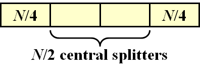

# WEEK 13 

## 13 Randomized Algorithms

### 13.1 Introduction

#### What to Randomize

- The world behaves randomly – randomly generated input solved by traditional algorithm

  Average-case Analysis

- The algorithm behaves randomly – make random decisions as the algorithm processes the worst-case input

  Randomized Algorithms

#### Why Randomize

- Efficient deterministic(确定性) algorithms that always yield the correct answer are a **special case** of – 

  - efficient randomized algorithms that only need to yield the correct answer with **high probability**

  - randomized algorithms that are always correct, and run efficiently **in expectation**

#### A Quick Review

- $Pr[ A ]$ := the probability of the even $A$

- $\overline{A}$ := the complementary of the even $A$ ($A$ did not occur )
  $$
  Pr[A]+Pr[\overline{A}]=1
  $$

- $E[ X ]$ := the expectation (the “average value”) of the random variable $X$
  $$
  E[X]=\sum^{\infin}_{j=0}j\cdot Pr[X=j]
  $$

### 13.2 Hiring Problem

-  Hire an office assistant from headhunter 
- Interview a different applicant per day for $N$ days
- Interviewing Cost = $C_i$  <<  Hiring Cost = $C_h$
- Analyze interview & hiring cost instead of running time
- Assume $M$ people are hired
- Minimize the total cost: $O(NC_i+MC_h)$

#### Naive Solution

```pseudocode
int Hiring ( EventType C[ ], int N )
{   /* candidate 0 is a least-qualified dummy candidate */
    int Best = 0;
    int BestQ = the quality of candidate 0;
    for (i = 1; i <= N; i++) 
    {
        Qi = interview( i ); /* Ci */
        if ( Qi > BestQ ) 
        {
            BestQ = Qi;
            Best = i;
            hire( i );  /* Ch */
        }
    }
    return Best;
}
```

- Worst case: The candidates come in increasing quality order
- $T(N)=O(NC_h)$

#### Randomized Algorithm

- Assume candidates arrive in **random** order
- $X$ = number of hires

$$
E[X]=\sum^N_{j=1}j\cdot Pr[X=j]\\
X_i=
\begin{cases}
1,  & \text{if candidate $i$ is hired} \\
0, & \text{if candidate $i$ is NOT hired}
\end{cases}\\
X=\sum^N_{i=1}X_i\\
E[X_i]=Pr[\text{candidate $i$ is hired}]=1/i\\
E[X]=E[\sum^N_{i=1}X_i]=\sum^N_{i=1}E[X_i]=\sum^N_{i=1}1/i=\ln N+O(1)\\
O(C_h\ln N+NC_i)
$$

```pseudocode
int RandomizedHiring ( EventType C[ ], int N )
{   /* candidate 0 is a least-qualified dummy candidate */
    int Best = 0;
    int BestQ = the quality of candidate 0;

    randomly permute the list of candidates;

    for ( i=1; i<=N; i++ ) {
        Qi = interview( i ); /* Ci */
        if ( Qi > BestQ ) {
            BestQ = Qi;
            Best = i;
            hire( i );  /* Ch */
        }
    }
}
```

#### Randomized Permutation Algorithm

- **Target**: Permute array A[ ]
- Assign each element A[ i ] a **random priority** P[ i ], and sort

```pseudocode
void PermuteBySorting ( ElemType A[ ], int N )
{
    for ( i = 1; i <= N; i++ )
        A[i].P = 1 + rand()%(N3); 
        /* makes it more likely that all priorities are unique */
    Sort A, using P as the sort keys;
}
```

- **Claim**: `PermuteBySorting` produces a **uniform random permutation** of the input, assuming all priorities are distinct

#### Online Hiring Algorithm

- hire only once

```pseudocode
int OnlineHiring ( EventType C[ ], int N, int k )
{
    int Best = N;
    int BestQ = -INFINI ;
    for ( i = 1; i <= k; i++ ) {
        Qi = interview( i );
        if ( Qi > BestQ ) BestQ = Qi;
    }
    for ( i = k+1; i <= N; i++ ) {
        Qi = interview( i );
        if ( Qi > BestQ ) {
            Best = i;
            break;
        }
    }
    return Best;
}
```

- $S_i$ = the $i$th applicant is the best
- $A$ = the best one is at position $i$
- $B$ = no one at positions $k+1$ ~ $i–1$ are hired

$$
Pr[S_i]=Pr[A\cap B]=Pr[A]\cdot Pr[B]=\frac{1}{N}\cdot\frac{k}{i-1}=\frac{k}{N(i-1)}\\
Pr[S]=\sum^N_{i=k+1}Pr[S_i]=\sum^N_{i=k+1}\frac{k}{N(i-1)}=\frac{k}{N}\sum^{N-1}_{i=k}\frac{1}{i}
$$

- The probability we hire the best qualified candidate for a given $k$
  $$
  \frac{k}{N}\ln(\frac{N}{k})\leq Pr[S]\leq\frac{k}{N}\ln(\frac{N-1}{k-1})
  $$

- The best value of k to maximize the probability
  $$
  \frac{d}{dk}(\frac{k}{N}\ln(\frac{N}{k}))=\frac{1}{N}(\ln N-\ln k-1)=0\rarr k=\frac{N}{e}
  $$
  Succeed in hiring the best-qualified applicant with probability at least $1/e$

### 13.3 Randomized Quicksort

- The worst case running time: $\Theta(N^2)$
- The average case running time: $\Theta(N\log N)$, assuming every input permutation is equally likely
- Choose the pivot uniformly at random
- **Central splitter** = the pivot that divides the set so that each side contains at least $n/4$
- Modified Quicksort: always select a central splitter before recursions

- **Claim**: The expected number of iterations needed until we find a central splitter is at most 2

  

  $Pr[\text{find a  central spliter}]=1/2$

- **Type $j$**: the subproblem $S$ is of type $j$ if $N(\frac{3}{4})^{j+1}\leq|S|\leq N(\frac{3}{4})^j$

- **Claim**: There are at most $(\frac{4}{3})^{j+1}$ subproblems of type $j$

$$
E[T_{\text{type }j}]=O(N(\frac{3}{4})^j)\cdot(\frac{4}{3})^{j+1}=O(N)\\
\text{Number of different types}=\log_{4/3}N=O(\log N)
$$

