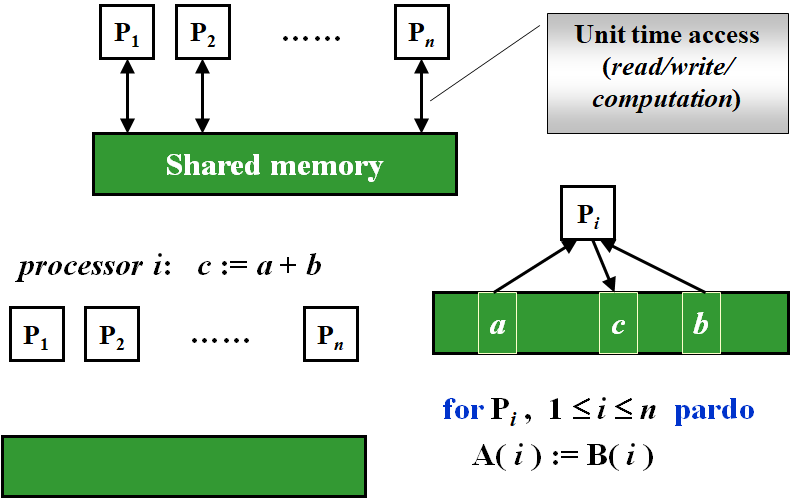
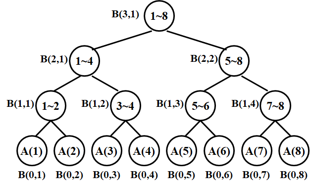
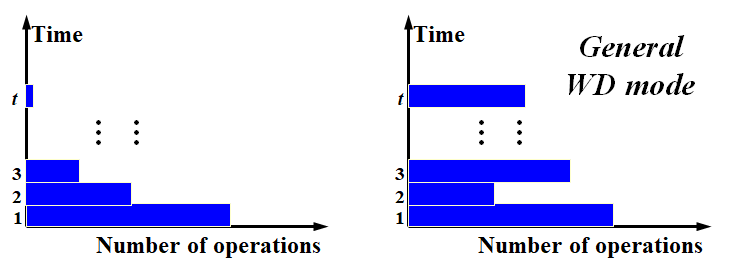
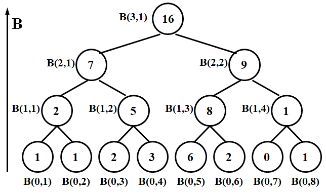
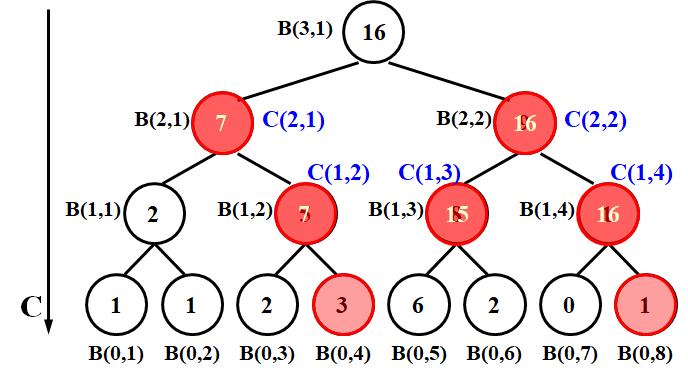
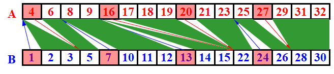
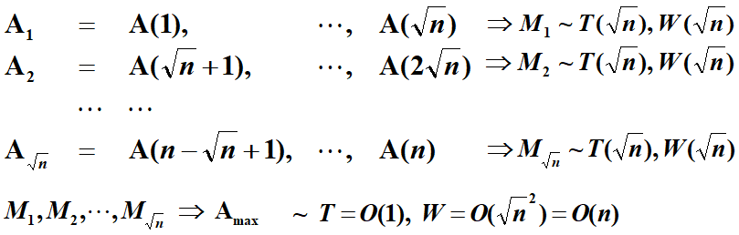
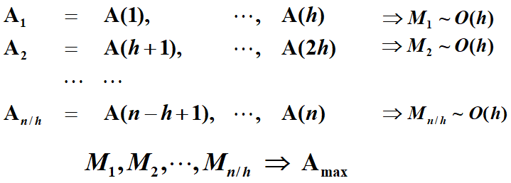
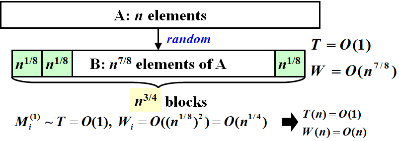
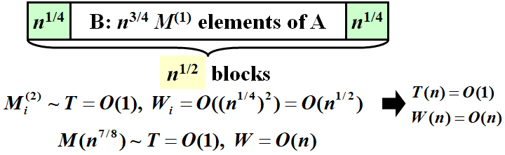

# WEEK 14

## 14 Parallel Algorithm

### 14.1 Parallel Random Access Machine (PRAM)



#### To resolve access conflicts

- Exclusive-Read Exclusive-Write (EREW)
- Concurrent-Read Exclusive-Write (CREW)
- Concurrent-Read Concurrent-Write (CRCW)
  - Arbitrary rule
  - Priority rule (P with the smallest number)
  - Common rule (if all the processors are trying to write the same value)

#### The summation problem

- Input: $A(1), A(2), \cdots, A(n)$
- Output: $ A(1) + A(2) + \cdots +A(n)$


$$
B(h, i) = B(h-1, 2i-1) + B(h-1, 2i)
$$

```pseudocode
for Pi, 1 <= i <= n pardo
	B(0, i) := A( i )
for h = 1 to log n do
	if i <= n/2^h
		B(h, i) := B(h-1, 2i-1) + B(h-1, 2i)
    else stay idle
for i = 1: output B(log n, 1); for i > 1: stay idle
```

$$
T(n)=\log n+2
$$

#### Disadvantages

- Does not reveal how the algorithm will run on PRAMs with different number of processors
- Fully specifying the allocation of instructions to processors requires a level of detail which might be unnecessary

### 14.2 Work-Depth (WD) Presentation

```pseudocode
for Pi, 1 <= i <= n pardo
	B(0, i) := A( i )
for h = 1 to log n 
	for Pi, 1 <= i <= n/2^h  pardo
    	 B(h, i) := B(h-1, 2i-1) + B(h-1, 2i)
for i = 1 pardo
   output  B(log n, 1) 
```



#### Measuring the performance

- Work load – total number of operations: $W(n)$
- Worst-case running time: $T(n)$
- All asymptotically equivalent
  - $W(n)$ operations and $T(n)$ time
  - $P(n) = W(n)/T(n)$ processors and $T(n)$ time (on a PRAM)
  - $W(n)/p$ time using any number of $p \leq W(n)/T(n)$ processors (on a PRAM)
  - $W(n)/p + T(n)$ time using any number of p processors (on a PRAM)

```
for Pi, 1 <= i <= n pardo
	B(0, i) := A( i )
for h = 1 to log n 
	for Pi, 1 <= i <= n/2^h  pardo
    	 B(h, i) := B(h-1, 2i-1) + B(h-1, 2i)
for i = 1 pardo
   output  B(log n, 1) 
```

$$
T(n)=\log n+2\\
W(n)=n+n/2+n/2^2+\cdots+n/2^k\quad\text{where $2^k=n$}\\
=2n
$$

#### WD-presentation Sufficiency Theorem

An algorithm in the WD mode can be implemented by **any** $P(n)$ processors within $O(W(n)/P(n) + T(n))$ time, using the same concurrent-write convention as in the WD presentation.

### 14.3 Prefix-Sums

- Input: $A(1),A(2),\cdots,A(n)$
- Output: $\sum^1_{i=1}A(i),\sum^2_{i=1}A(i),\cdots,\sum^n_{i=1}A(i)$
- Technique: **Balanced Binary Trees**





- $C(h,i)=\sum^\alpha_{k=1}A(k)$ where $(0,\alpha)$ is the **rightmost descendant leaf** of node $(h, i)$
- if ( i==1 ) C(h, i) := B(h, i)
- if ( i%2 == 0 ) C(h, i) := C(h+1, i/2)
- if (i%2 == 1 && i != 1)  C(h, i) := C(h+1, (i-1)/2) + B(h, i)

```pseudocode
for Pi, 1 <= i <= n pardo
    B(0, i) := A(i)
for h = 1 to log n
  for i, 1 <= i <= n/2^h pardo
      B(h, i) := B(h-1, 2i-1)+B(h-1, 2i)
for h = log n to 0
    for i even, 1 <= i <= n/2^h pardo
        C(h, i) := C(h+1, i/2)
    for i = 1 pardo
        C(h, 1) := B(h, 1)
    for i odd, 3 <= i <= n/2^h pardo
    	C(h, i) := C(h+1, (i-1)/2)+B(h, i)
for Pi, 1 <= i <= n pardo
    Output C(0, i)
```

$$
T(n)=O(\log n)\\
W(n)=O(n)
$$

### 14.4 Merging

- Merge two non-decreasing arrays $A(1), A(2), \cdots, A(n)$ and $B(1), B(2), \cdots, B(m)$ into another non-decreasing array $C(1), C(2), \cdots, C(n+m) $
- Technique: **Partitioning**

#### Partitioning Paradigm

- **partitioning**: partition the input into a large number, say p, of independent small jobs, so that the size of the largest small job is roughly n/p
- **actual work**: do the small jobs concurrently, using a separate (possibly serial) algorithm for each
- Merging $\rarr$ Ranking
  - $RANK( j, A) = i$,   if $A(i) < B(j) < A(i + 1)$, for $1 \leq i < n$
  - $RANK( j, A) = 0$,  if $B(j) < A(1)$ 
  - $RANK( j, A) = n$,  if $B(j) > A(n)$
- The ranking problem, denoted $RANK(A,B)$ is to compute:
  - $RANK( i, B)$ for every $1 \leq i \leq n$
  - $RANK( i, A)$ for every $1 \leq i \leq n$
- **Claim**: Given a solution to the ranking problem, the merging problem can be solved in $O(1)$ time and $O(n+m)$ work

```pseudocode
for Pi, 1 <= i <= n pardo
    C(i + RANK(i, B)) := A(i)
for Pi, 1 <= i <= n pardo
    C(i + RANK(i, A)) := B(i)
```

##### Binary Search

```pseudocode
for Pi , 1 <= i <= n pardo
    RANK(i, B) := BS(A(i), B)
    RANK(i, A) := BS(B(i), A)
```

$$
T(n)=O(\log n)\\
W(n)=O(n\log n)
$$

##### Serial Ranking

```pseudocode
i = j = 0; 
while (i <= n || j <= m) 
{
    if (A(i+1) < B(j+1)) RANK(++i, B) = j;
    else RANK(++j, A) = i;
}
```

$$
T(n)=W(n)=O(n+m)
$$

#### Parallel Ranking

##### Stage 1: Partitioning

- 每段划分为 $\log n$ 大小，$p=n/\log n$
- $A\_Select(i)=A(1+(i-1)\log n)$ for $1\leq i\leq p$
- $B\_Select(i)=B(1+(i-1)\log n)$ for $1\leq i\leq p$
- Compute RANK for each selected element



##### Stage 2: Actual Ranking

- At most $2p$ smaller sized $O(\log n)$ problems

$$
T=O(\log n)\\
W=O(p\log n)=O(n)
$$

### 14.5 Maximum Finding

#### Replace “+” by “max” in the summation algorithm

$$
T(n)=O(\log n)\\
W(n)=O(n)
$$

#### Compare all pairs

```pseudocode
for Pi, 1 <= i <= n pardo
    B(i) := 0
for i and j, 1 <= i, j <= n pardo
    if ((A(i) < A(j)) || ((A(i) = A(j)) && (i < j))) B(i) = 1
    else B(j) = 1
for Pi, 1 <= i <= n pardo
    if B(i) == 0 A(i) is a maximum in A
```

- To resolve access conflicts: Concurrent-Read Concurrent-Write (CRCW)

$$
T(n)=O(1)\\
W(n)=O(n^2)
$$

#### A Doubly-logarithmic Paradigm

- Assume that $h = \log \log n$ is an integer 

##### Partition by $\sqrt n$


$$
T(n)\leq T(\sqrt n)+c_1,W(n)\leq\sqrt nW(\sqrt n)+c_2n\\
\rarr T(n)=O(\log\log n),W(n)=O(n\log\log n)
$$

##### Partition by $h=\log\log n$


$$
T(n)=O(h+\log\log(n/h))=O(\log\log n)\\
W(n)=O(h*(n/h)+(n/h)\log\log(n/h))=O(n)
$$

#### Random Sampling

- Parallel random sampling algorithm can run in $O(1)$ time and $O(N)$ work with very high probability, on an arbitrary CRCW PRAM





```pseudocode
while (there is an element larger than M) {
     for (each element larger than M)
         Throw it into a random place in a new B(n^(7/8));
     Compute a new M;
}
```

##### [Theorem] The algorithm finds the maximum among n elements.  With very high probability it runs in $O(1)$ time and $O(n)$ work.  The probability of not finishing within this time and work complexity is $O(1/n^c)$ for some positive constant $c$
