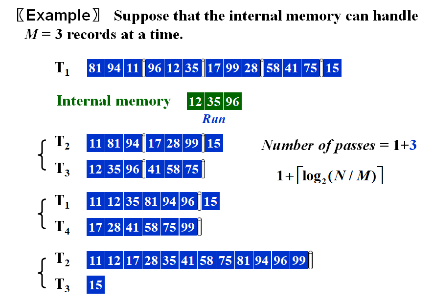
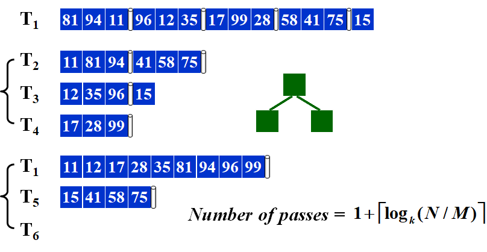
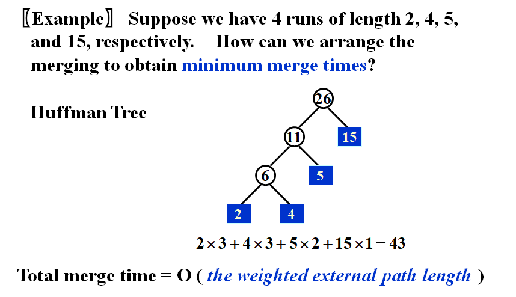

# WEEK 15

## 15 External Sorting

### 15.1 Introduction

- Quicksort on a disk is not simple
- To get a[i] on internal memory — $O(1)$
- To get a[i] on hard disk — **device-dependent**
  - find the track
  - find the sector
  - find a[i] and transmit
- If only one tape drive is available to perform the external sorting, then the tape access time for any algorithm will be $\Omega(N^2)$
- **Tool**: Mergesort
- To simplify
  - Store data on tapes (can only be accessed sequentially)
  - Can use at least 3 tape drives

> Q: Given 10,000,000 records of 128 bytes each, and the size of the internal memory is 4MB. How many passes we have to do?
>
> A: 1+ log(320 runs) = 1 + 9

- Concerns
  - Seek time — $O(\text{number of passes})$
  - Time to **read or write** one **block** of records
  - Time to **internally sort** $M$ records
  - Time to **merge** $N$ records from input buffers to the output buffer(Computer can carry out I\O and CPU processing in **parallel**)
- Targets
  - Reduction of the number of passes
  - Run merging
  - Buffer handling for parallel operation
  - Run generation

### 15.2 Pass Reduction

#### **k-way** merge

- Require **2k** tapes

#### Use 3 tapes for a 2-way merge

- Split **unevenly**
- **Claim**: If the number of runs is a Fibonacci number $F_N$, then the best way to distribute them is to split them into $F_{N–1}$ and $F_{N–2}$
- **Claim**: For a k-way merge, $F^{(k)}_N=F^{(k)}_{N-1}+F^{(k)}_{N-2}$, where $F^{(k)}_0=0(0\leq N\leq k-2),F^{(k)}_{k-1}=1$
  - Polyphase Merge
  - Require k + 1 tapes only

### 15.3 Buffer Handling

- For a k-way merge we need **2k input** buffers and **2 output** buffers for parallel operations
- k⬆ $\rarr$ num of input buffers⬆ $\rarr$ buffer size⬇ $\rarr$ block size on disk⬇ $\rarr$ seek time⬆
- Beyond a certain k value, the I\O time would actually **increase** despite the decrease in the number of passes being made.  The optimal value for k clearly depends on disk parameters and the amount of internal memory available for buffers.

### 15.4 Run Generation

#### Replacement Selection

- $L_{avg}=2M$
- Powerful when input is often **nearly sorted** for external sorting

#### Minimize the Merge Time

